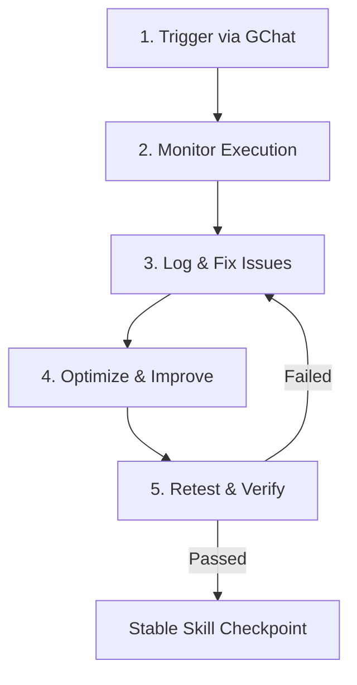

# Repeatable Fleet Agent Skill Testing & Improvement Playbook

Use this skill to systematically test, monitor, debug, and optimize the brain functionality of fleet agents when they use a specific CoreKit or Workspace skill. This ensures that when a human issues a prompt in Google Chat, the agent's brain executes the skill correctly, recovers from errors, and validates the output.

---

## The 5-Step Process



---

## 1. Trigger via GChat

To test a specific fleet agent skill (e.g., `workspace-drive`, `web-search`, or a custom command), you must inject an instruction into the Google Chat space where the agent is active.

### A. Resolve target parameters
1. **Target Agent & Email**:
   - Stan (DevOps): `devops-agent-stan@tachin.ag`
   - Bobby (SWE): `engineer-agent-bobby@tachin.ag`
   - Archie (Architect): `product-architect-agent-archie@tachin.ag`
   - Dot (Designer): `designer-agent-dot@tachin.ag`
2. **Project GChat Space**:
   - Locate the target project in the Firestore `projects/` collection to find its `gchat_space_id` (e.g., `Project: tachin-website` -> `GChat Space: AAQA2JEusfs`).
   - The corresponding GChat space ID is `spaces/AAQA2JEusfs`.

### B. Inject message using Domain-Wide Delegation (DWD)
Run `chat-send` via SSH on `prime-chuck` to send a message. Impersonate another team member (e.g., Archie) to issue a command that mentions the target agent.

```powershell
# SSH to prime-chuck and send a GChat mention trigger
echo y | gcloud compute ssh prime-chuck --zone=us-central1-a --project=architect-prime-beta --tunnel-through-iap --command="CORE_DIR=/opt/corekit AGENT_USER_EMAIL=product-architect-agent-archie@tachin.ag CHAT_SPACE_ID=spaces/AAQA2JEusfs /opt/corekit/bin/chat-send '@Devops-Agent Stan please search Google Drive for the website asset folder and verify its contents.'"
```

---

## 2. Monitor Execution

Once the message is sent, the target agent's `ears` daemon will ingest the message, write it to Firestore `intake`, and wake up the `brain` daemon.

### A. Monitor System Logs on the VM
SSH into the target agent's VM (e.g., `fleet-stan` for Stan, `fleet-bobby` for Bobby) and tail the logs:

```powershell
# Check ears daemon logs (reception check)
echo y | gcloud compute ssh fleet-stan --zone=us-central1-a --project=architect-prime-beta --tunnel-through-iap --command="sudo tail -n 50 /var/log/agent-ears.log"

# Tail brain daemon logs (classification, checkpoint planning, actions)
echo y | gcloud compute ssh fleet-stan --zone=us-central1-a --project=architect-prime-beta --tunnel-through-iap --command="sudo journalctl -u agent-brain -n 50 -f"

# Tail gateway logs (real-time LLM interactions & tool calls)
echo y | gcloud compute ssh fleet-stan --zone=us-central1-a --project=architect-prime-beta --tunnel-through-iap --command="sudo journalctl -u agent-neural-gateway -n 50 -f"
```

### B. Track Firestore Work Envelopes
Check the `work` collection under `primes/chuck/work/` for the generated envelopes.
- Look for the top-level mission envelope (`type=M`, `status=active`, `owner=devops-agent-stan@tachin.ag`).
- Track the child checkpoints (`type=C`) and tasks (`type=T`) spawned by Prefrontal.

---

## 3. Log & Fix Issues

If the agent gets stuck, fails validation, or executes tools incorrectly, identify the root cause and patch it.

### A. Common Failure Modes
- **LoopGuard Triggers**: The agent keeps calling the same tool or hitting the same error (usually due to ambiguous instructions, missing tool parameters, or bad error parsing).
- **ESM Syntax Errors**: Invalid JS tokens or syntax issues (e.g., backslash-r `\r` CRLF line endings in scripts uploaded to Linux).
- **Cortex Decide Failures**: Prefrontal plan schema mismatch, or Cortex attempting to execute actions it doesn't own.
- **Motor Timeout (300s)**: A script or API request is hanging or waiting for user input.

### B. Deployment & Upgrade Cycle
When a fix is made in the codebase (e.g., editing a script in `corekit/` or updating a `SKILL.md` guide):
1. **Commit changes**: Stage files and commit using the mandatory version-prefixed commit message style (e.g., `v2026.06.19.1.0: fix drive search args`).
2. **Push to main**: Push the branch to GitHub.
3. **Upgrade VM**: Upgrade the target agent VM via the dashboard **Upgrade** button, or run the following command on the agent's GCE host:
   ```powershell
   echo y | gcloud compute ssh fleet-stan --zone=us-central1-a --project=architect-prime-beta --tunnel-through-iap --command="sudo /opt/corekit/bin/upgrade-corekit --apply main"
   ```

---

## 4. Find Opportunities for Improvement

Even if the agent completes the task, look for optimizations:
- **CoreKit Skill Documentation**: Improve the target skill's `SKILL.md` (e.g. in `skills/workspace-drive/SKILL.md`) by adding error recovery tables or better worked examples.
- **Task Accept Criteria**: Instruct the brain to output more explicit acceptance criteria so the Cerebellum can perform a high-fidelity verification check.
- **Deterministic Processes**: If the skill involves a standard recipe, create or link a Process definition in `corekit/config/processes/` instead of letting Cortex improvise.

---

## 5. Retest

After deploying improvements, repeat Step 1:
- Re-run the `chat-send` trigger command with the same instructions.
- Ensure the agent successfully traverses the entire plan.
- Confirm the Cerebellum evaluates the outputs as `ALL_PASS`.
