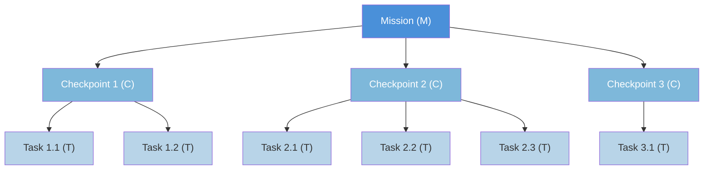
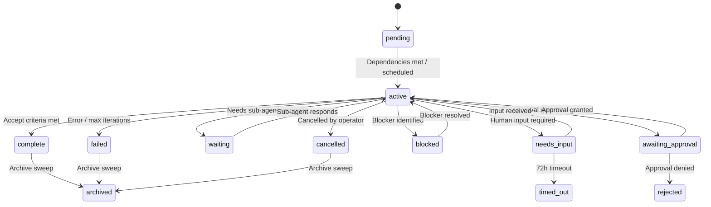
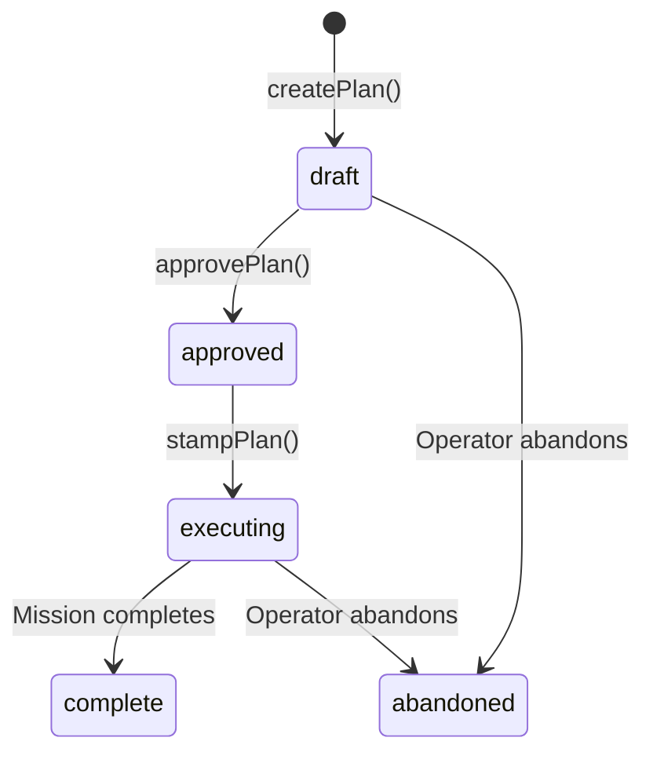

# Culture of Work

The Culture of Work is the operational framework that governs how Architect Prime agents plan, execute, track, and verify work. It defines **7 primitives** that compose into a hierarchy, enforced by the brain daemon (`agent-brain.mjs`) and stored in Firestore.

---

## The 7 Primitives

| Primitive | Envelope Type | Purpose |
|-----------|:---:|---------|
| **Task** | `T` | Atomic unit of work dispatched to a single agent |
| **Checkpoint** | `C` | Groups related Tasks; sequential execution with verification |
| **Mission** | `M` | Self-contained goal with accept criteria |
| **Project** | — | Organizational container (recursive, with context) |
| **Process** | — | Reusable template that produces Plans |
| **Plan** | — | Unexecuted Mission blueprint (M→C→T layout) |
| **Responsibility** | `R` | Scheduled or event-triggered work |

Three of these (Task, Checkpoint, Mission) are **WorkEnvelope** types stored in the `primes/{id}/work/{workId}` Firestore collection. Responsibility envelopes (type `R`) also use the WorkEnvelope format but serve as thin wrappers. Projects, Processes, and Plans are separate Firestore collections.

---

## The M→C→T Hierarchy

All executable work follows a strict three-level hierarchy:



**Rules:**
- A Mission contains one or more Checkpoints
- A Checkpoint contains one or more Tasks
- Tasks are the leaves — they are dispatched to agents (motor, cerebellum, etc.)
- Checkpoints execute **sequentially**. All Tasks within a Checkpoint must complete before the next Checkpoint begins.
- The brain daemon manages the full lifecycle — no LLM involvement in structure or flow control.

### Responsibility → Mission Wrapping

When a Responsibility fires, it creates an **R→M envelope pair**: a Responsibility envelope (type `R`) that immediately completes, wrapping a Mission envelope (type `M`) that contains the actual work hierarchy.

```
R (Responsibility) → M (Mission) → C₁ → T₁, T₂ → C₂ → T₃ ...
```

---

## Status Flow

All WorkEnvelopes share a common status set:



**Status values:**
`pending` · `active` · `complete` · `failed` · `waiting` · `needs_input` · `blocked` · `cancelled` · `archived` · `awaiting_approval` · `planned` · `rejected` · `timed_out`

### Upward Propagation

- When all Tasks in a Checkpoint complete → Checkpoint auto-completes
- When all Checkpoints in a Mission complete → Mission auto-completes
- When any Task fails (and is not optional) → Checkpoint fails → Mission fails
- Approval gates pause the entire M→C→T hierarchy until human approval

---

## Projects — The Organizational Primitive

Projects are **recursive containers** that provide organizational context for Missions. They are not WorkEnvelopes — they live in the `primes/{id}/projects/` Firestore collection.

### Key Properties

- **Recursive**: Projects can nest via `parent_id` (depth limit: **4 levels**)
- **Context accumulation**: Child projects inherit context from parents (most specific wins)
- **Dependency management**: Projects support `depends_on` between sibling projects
- **Status**: `active` · `complete` · `paused` · `archived`

### The `project_id` Enforcement Rule

> **Every Mission must have a `project_id`.** No Mission can be written to Firestore with `project_id: null`.

When no explicit project applies, the agent's **default project** (`{agent-id}/general`) is used. This is created automatically at agent startup.

Project ID is propagated:
- `processIntake()` → uses cortex classification or falls back to default
- `executeProcess()` → from decision context or default
- `fireResponsibility()` → from `resp.project_id` or default
- `handleAttach()` → inherited from parent Mission
- `stampPlan()` → from Plan's `project_id`

---

## Plans — Unexecuted Missions

A Plan is a **blueprint** for a Mission. It contains the full M→C→T layout without creating any WorkEnvelopes. Plans are stored in `primes/{id}/plans/`.

### Lifecycle



| State | Meaning |
|-------|---------|
| `draft` | Layout created, not yet approved |
| `approved` | Human/auto approved, ready to stamp |
| `executing` | WorkEnvelopes stamped, Mission running |
| `complete` | Linked Mission completed successfully |
| `abandoned` | Plan discarded before or during execution |

### How Plans Route Through the Engine

1. `createPlan(processId, parameters, projectId)` → calls `processToCheckpointPlan()`, stores the layout
2. `approvePlan(planId, approvedBy)` → transitions to `approved`
3. `stampPlan(planId)` → creates the full M→C→T hierarchy in Firestore, links `mission_id`

For auto-approved work (simple processes, routine Responsibility firings), all three steps happen in a single call — current behavior preserved, just routed through the Plan layer.

### Amendments

Plans can be amended during `draft`, `approved`, or `executing` status via `amendPlan()`. Each amendment records a timestamp, reason, changes, and who amended it.

---

## Processes — Reusable Templates

Processes are **reusable work templates** that define a sequence of steps, grouped into checkpoints. They live on disk at `corekit/config/processes/*.json` and are loaded into Firestore at `primes/{id}/processes/`.

### How Processes Produce Plans

```
Process + Parameters → processToCheckpointPlan() → Plan layout → stampPlan() → M→C→T envelopes
```

Key features:
- **Parameter substitution**: `${param}` and `{{param}}` syntax in step descriptions
- **Checkpoint boundaries**: Steps with `checkpointBoundary: true` mark where one checkpoint ends
- **Step types**: `standard` (default), `approval_gate` (pauses for human approval)
- **Intent types**: `execute` (writes/changes), `research` (read-only)
- **Sub-process composition**: Steps with `sub_process` field inline another process's steps (circular refs rejected)

### Core Processes

| Process | ID | Purpose |
|---------|------|---------|
| Feature Implementation | `p-implement` | Branch → implement → validate → commit |
| Code Review | `p-review` | Read diff → correctness → conventions → verdict |
| Codebase Audit | `p-audit` | Define criteria → scan → classify → report |
| Investigation | `p-investigate` | Frame → gather evidence → analyze → document |
| Deployment Verification | `p-deploy-verify` | Health check → smoke test → regression |
| Release | `p-release` | Pre-flight → **approval gate** → tag → deploy → verify → announce |

See [AUTHORING_PROCESSES.md](guides/AUTHORING_PROCESSES.md) for the full schema reference.

---

## Responsibilities — Scheduled Work

Responsibilities are **scheduled or event-triggered work definitions** that produce R→M envelope pairs when they fire. They are defined in `corekit/config/responsibilities.json` and managed by the brain daemon's cron scheduler.

### How They Fire

1. Every 60 seconds, the brain daemon checks all enabled responsibilities
2. For each responsibility whose cron expression matches: check `min_spacing_minutes`
3. If spacing allows: fire the responsibility
4. Firing creates an `R` envelope (immediately complete) wrapping an `M` envelope
5. If `processRef` is set: the linked process executes deterministically
6. If no `processRef`: the Mission is dispatched through the normal cortex decide loop

### Event Triggers (Planned)

The `trigger` field enables event-driven responsibilities: `on_merge`, `on_deploy`, `on_failure`. When a matching event occurs, `fireEventResponsibilities(eventType)` fires all responsibilities with that trigger.

See [AUTHORING_RESPONSIBILITIES.md](guides/AUTHORING_RESPONSIBILITIES.md) for the full schema reference.

---

## Dependency Management

### Mission Dependencies (`depends_on`)

Missions can declare dependencies on other Missions via the `depends_on` array field on WorkEnvelope.

**Behavior:**
- A `pending` Mission with `depends_on` stays `pending` until all dependency Missions are `complete` or `archived`
- `checkDependencies(envelope)` evaluates deps (fails open on errors)
- When a Mission completes, `activateDependents(completedMissionId)` scans for pending Missions that list it in `depends_on` and activates those whose deps are all met
- Circular dependencies are rejected at write time

### Project Dependencies (`depends_on`)

Projects also support `depends_on` between sibling projects. A Project with unmet dependencies stays `paused` until all dependency Projects are `complete` or `archived`.

---

## The Approval Gate Mechanism

Processes can include **approval gate** steps that pause execution and wait for human sign-off.

### How It Works

1. Process step has `"type": "approval_gate"` and `"intent": "approval_gate"`
2. When the executor reaches this step:
   - Generates an approval ID
   - Writes an approval document to `primes/{id}/approvals/{approvalId}`
   - Marks the Task, Checkpoint, and Mission as `awaiting_approval`
   - Sends a notification to the operator (via Mouth → dashboard/chat)
3. Operator approves or rejects via dashboard
4. On approval: `resumeProcessAfterApproval()` marks the gate task complete and resumes from the next task
5. On rejection: Mission status transitions to `rejected`

The approval gate is **hierarchical** — it pauses the entire M→C→T stack, not just the individual Task.

---

## Document Index

### Primitive References
- [01 — Task](primitives/01-TASK.md)
- [02 — Checkpoint](primitives/02-CHECKPOINT.md)
- [03 — Mission](primitives/03-MISSION.md)
- [04 — Project](primitives/04-PROJECT.md)
- [05 — Process](primitives/05-PROCESS.md)
- [06 — Plan](primitives/06-PLAN.md)
- [07 — Responsibility](primitives/07-RESPONSIBILITY.md)

### Authoring Guides
- [Authoring Processes](guides/AUTHORING_PROCESSES.md)
- [Authoring Responsibilities](guides/AUTHORING_RESPONSIBILITIES.md)
