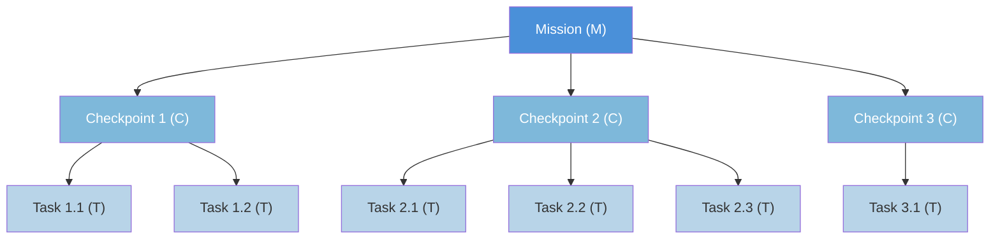
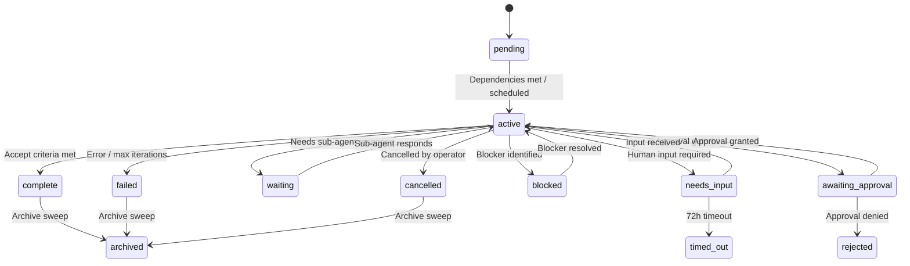
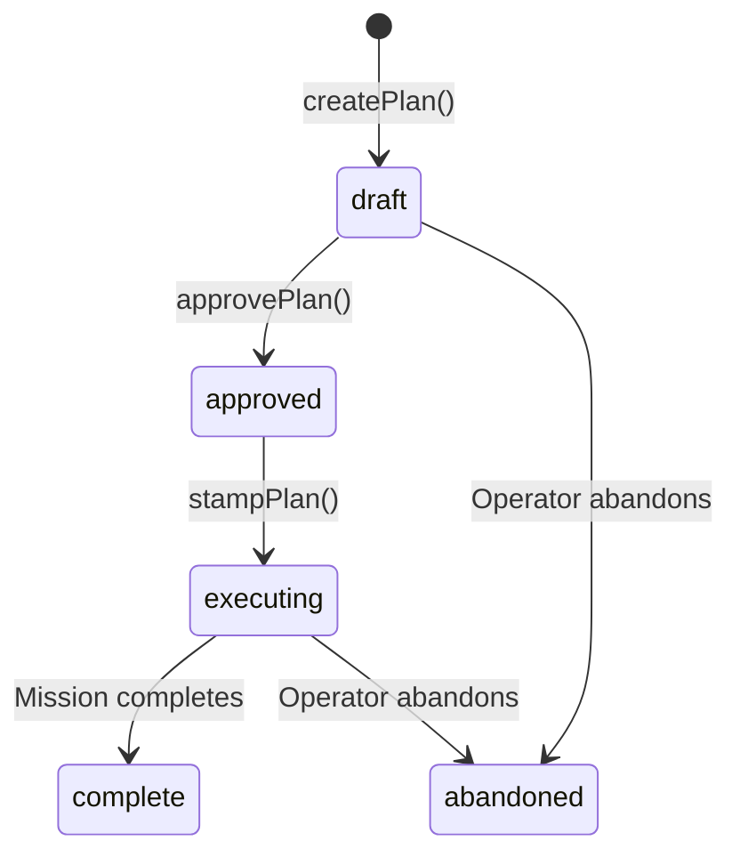
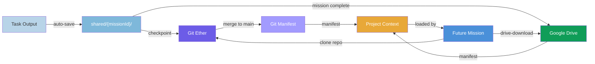

# Culture of Work

The Culture of Work is the operational framework that governs how Architect Prime agents plan, execute, track, and verify work. It defines **9 primitives** that compose into a hierarchy, enforced by the brain daemon (`agent-brain.mjs`) and stored in Firestore.

---

## The 9 Primitives

| Primitive | Envelope Type | Purpose |
|-----------|:---:|---------|
| **Task** | `T` | Atomic unit of work dispatched to a single agent |
| **Checkpoint** | `C` | Groups related Tasks; sequential execution with verification |
| **Mission** | `M` | Self-contained goal with accept criteria |
| **Project** | — | Organizational container (recursive, with context) |
| **Process** | — | Named narrative playbook — how a recurring kind of work is done well; recalled into the agent's own plan |
| **Plan** | — | Unexecuted Mission blueprint (M→C→T layout) |
| **Responsibility** | `R` | Scheduled or event-triggered work |
| **Artifact** | — | Persistent work product in git ether + Google Drive |
| **Skill** | — | Codified, versioned procedure an organ follows instead of re-deriving — the sole home of tool syntax and multi-step how-to (B-16/B-17) |

Three of these (Task, Checkpoint, Mission) are **WorkEnvelope** types stored in the `primes/{id}/work/{workId}` Firestore collection. Responsibility envelopes (type `R`) also use the WorkEnvelope format but serve as thin wrappers. Projects, Processes, and Plans are separate Firestore collections. Artifacts live in the git artifact substrate (C-24) — GCS-backed repos with Firestore CAS refs — and are also published to Google Drive for stakeholder access. Skills are versioned procedure packages installed to agents via manifests (C-9); they are the sole home of tool-level HOW (B-16/B-17), which planning organs reference by name and the executor follows — never re-derived in a SOUL or a plan.

---

## The M→C→T Hierarchy

All executable work follows a strict three-level hierarchy:



**Rules:**
- A Mission contains one or more Checkpoints
- A Checkpoint contains one or more Tasks
- Tasks are the leaves — they are dispatched to agents (motor, cerebellum, etc.)
- Checkpoints execute **sequentially**. All Tasks within a Checkpoint must complete before the next Checkpoint begins.
- The brain daemon manages the full lifecycle — no LLM involvement in structure or flow control.

### Responsibility → Mission Wrapping

When a Responsibility fires, it creates an **R→M envelope pair**: a Responsibility envelope (type `R`) that immediately completes, wrapping a Mission envelope (type `M`) that contains the actual work hierarchy.

```
R (Responsibility) → M (Mission) → C₁ → T₁, T₂ → C₂ → T₃ ...
```

---

## Status Flow

All WorkEnvelopes share a common status set:



**Status values:**
`pending` · `active` · `complete` · `failed` · `waiting` · `needs_input` · `blocked` · `cancelled` · `archived` · `awaiting_approval` · `planned` · `rejected` · `timed_out`

### Upward Propagation

- When all Tasks in a Checkpoint complete → Checkpoint auto-completes
- When all Checkpoints in a Mission complete → Mission auto-completes
- When any Task fails (and is not optional) → Checkpoint fails → Mission fails
- Approval gates pause the entire M→C→T hierarchy until human approval

---

## Projects — The Organizational Primitive

Projects are **recursive containers** that provide organizational context for Missions. They are not WorkEnvelopes — they live in the `primes/{id}/projects/` Firestore collection.

### Key Properties

- **Recursive**: Projects can nest via `parent_id` (depth limit: **4 levels**)
- **Context accumulation**: Child projects inherit context from parents (most specific wins)
- **Dependency management**: Projects support `depends_on` between sibling projects
- **Status**: `active` · `complete` · `paused` · `archived`

### The `project_id` Enforcement Rule

> **Every Mission must have a `project_id`.** No Mission can be written to Firestore with `project_id: null`.

When no explicit project applies, the agent's **default project** (`{agent-id}/general`) is used. This is created automatically at agent startup.

Project ID is propagated:
- `processIntake()` → uses cortex classification or falls back to default
- `fireResponsibility()` → from `resp.project_id` or default
- `handleAttach()` → inherited from parent Mission
- `stampPlan()` → from Plan's `project_id`

---

## Plans — Unexecuted Missions

A Plan is a **blueprint** for a Mission. It contains the full M→C→T layout without creating any WorkEnvelopes. Plans are stored in `primes/{id}/plans/`.

### Lifecycle



| State | Meaning |
|-------|---------|
| `draft` | Layout created, not yet approved |
| `approved` | Human/auto approved, ready to stamp |
| `executing` | WorkEnvelopes stamped, Mission running |
| `complete` | Linked Mission completed successfully |
| `abandoned` | Plan discarded before or during execution |

### How Plans Route Through the Engine

1. `createPlan(...)` → stores the M→C→T layout the agent's `checkpoint_plan` committed
2. `approvePlan(planId, approvedBy)` → transitions to `approved`
3. `stampPlan(planId)` → creates the full M→C→T hierarchy in Firestore, links `mission_id`

For auto-approved work (low-risk plans, routine Responsibility firings), all three steps happen in a single call — current behavior preserved, just routed through the Plan layer.

### Amendments

Plans can be amended during `draft`, `approved`, or `executing` status via `amendPlan()`. Each amendment records a timestamp, reason, changes, and who amended it.

---

## Processes — Narrative Playbooks

Processes are **narrative playbooks** — named accounts of how a recurring kind of work is done well. A
process is not a program the daemon executes; it is a prior the agent **recalls into its own plan**. The
source of truth is the one global, tenant-wide `processes` collection at the Firestore root, readable
and writable by every agent across every prime; the repo seeds a few starter narratives on disk at
`corekit/config/processes/*.json`.

A process is the sibling of a Skill: a skill teaches **how** to drive a tool (tool syntax, flags,
procedure); a process narrates **what** has worked for a kind of work (a contextual pattern, no tool
syntax). Its shape is exactly **name + short description + narrative**, plus `intent_keywords` for
recall and a `version`/`status` — no `steps`, no `parameters`, no gates.

### How a playbook is used

```
Mission resembles a pattern → narrative recalled (a prior) → agent's checkpoint_plan → M→C→T envelopes
```

When a mission matches a known playbook (by `intent_keywords` and the recall corpus), its narrative is
injected into the cortex's planning context. The agent then plans its own checkpoints and tasks,
adapting the pattern with full iterative control. The narrative **guides**; it never dispatches. There
is no `follow_process` action and no step-executor — the agent's `checkpoint_plan` is the sole path
that structures work (C-15).

### The living library

Playbooks are agent-owned and evolving, worked through five verbs: **capture · recall · update ·
discuss · take feedback**. Any agent — not just a PM or architect — can capture, refine, or retire a
playbook via the base `process-ops` skill. On mission completion, a temporal-memory reflex refreshes
the narrative of any playbook the mission actually used (bounded, conservative, honest, additive); the
nightly consolidation dedupes and retires the stale. Starter narratives the seed library ships include
`p-plan`, `p-review`, `p-audit`, `p-investigate`, `p-deploy-verify`, and `p-release` — but agents own
and evolve the living set.

See [AUTHORING_PROCESSES.md](guides/AUTHORING_PROCESSES.md) for how to author and evolve a playbook, and
[05-PROCESS.md](primitives/05-PROCESS.md) for the primitive definition.

---

## Responsibilities — Scheduled Work

Responsibilities are **scheduled or event-triggered work definitions** that produce R→M envelope pairs when they fire. They are defined in `corekit/config/responsibilities.json` and managed by the brain daemon's cron scheduler.

### How They Fire

1. Every 60 seconds, the brain daemon checks all enabled responsibilities
2. For each responsibility whose cron expression matches: check `min_spacing_minutes`
3. If spacing allows: fire the responsibility
4. Firing creates an `R` envelope (immediately complete) wrapping an `M` envelope
5. The Mission is dispatched through the normal cortex decide loop — the agent plans its own checkpoints (C-15); if the work matches a known playbook, that narrative is recalled into planning as a prior, never executed as steps

### Event Triggers

The `trigger` field enables event-driven responsibilities. Implemented triggers: `on_complete` (fires when a mission completes) and `on_failure` (fires when a mission fails). When a matching event occurs, `fireEventResponsibilities(eventType)` fires all responsibilities with that trigger.

Planned triggers (not yet implemented): `on_merge`, `on_deploy`.

See [AUTHORING_RESPONSIBILITIES.md](guides/AUTHORING_RESPONSIBILITIES.md) for the full schema reference.

---

## Artifacts — Persistent Work Products

Artifacts bridge the gap between ephemeral task outputs and lasting project knowledge. They are files produced during Mission execution that carry value beyond the current task — plans, reports, configs, code bundles, analysis results.

### Dual Substrate: Git + Drive

| Phase | Location | Trigger |
|-------|----------|---------|
| **Local** | `shared/{missionId}/` (git working tree) | Task output > 200 chars (auto) or agent writes directly |
| **Committed** | Git ether (GCS bundles + Firestore refs) | Checkpoint completes |
| **Published** | Git main branch + Google Drive project folder | Mission completes |
| **Discoverable** | Project context (git manifest + Drive manifest) | Future Mission loads context |

During execution, agents write to `shared/{missionId}/` — a local directory backed by a git working tree on a `mission/{missionId}` branch. The Brain daemon auto-saves any task output exceeding 200 characters. After each checkpoint, changes are committed and synced to the git ether. When the Mission completes, the branch is merged to `main` and all files are also uploaded to the project's Google Drive folder.

### Drive Folder Structure

```
{drive_root}/{project-name}/{prime-name}/{agent-name}/
```

Each project gets its own Drive folder under a configured root. Within a project, files are organized by prime and agent to avoid collisions between multi-agent work.

**Exception:** The default project (`{agentId}/general`) uses the agent's **My Drive root** instead of the shared hierarchy. General-purpose work stays in the agent's own space.

### Auto-Sharing

Published artifacts are automatically shared with:
- **Project owner** — Editor access
- **Team members** from `project.context.team` — Viewer access
- **Requesting user** (if user-initiated) — Viewer access

### Cross-Mission Discovery

Artifact manifests are accumulated in project context. When a future Mission loads its project context, prior artifact manifests are included — giving agents a list of what's already been produced, with `drive-download` commands for direct access.



### Agent Responsibility

Agents **MUST** include Google Drive links in their responses when they produce artifacts. Stakeholders should be able to access deliverables directly from the response without searching Drive.

See [08-ARTIFACT.md](primitives/08-ARTIFACT.md) for the full manifest schema, auto-persistence rules, and examples.

---

## Dependency Management

### Mission Dependencies (`depends_on`)

Missions can declare dependencies on other Missions via the `depends_on` array field on WorkEnvelope.

**Behavior:**
- A `pending` Mission with `depends_on` stays `pending` until all dependency Missions are `complete` or `archived`
- `checkDependencies(envelope)` evaluates deps (fails open on errors)
- When a Mission completes, `activateDependents(completedMissionId)` scans for pending Missions that list it in `depends_on` and activates those whose deps are all met
- Circular dependencies are rejected at write time

### Project Dependencies (`depends_on`)

Projects also support `depends_on` between sibling projects. A Project with unmet dependencies stays `paused` until all dependency Projects are `complete` or `archived`.

---

## The Approval Gate Mechanism

The agent's plan can include an **approval gate** step that pauses execution and waits for human
sign-off. The cortex places one before a destructive or public action (a `risk: destructive_or_public`
part in the Brief — see [ANALYZE_PHASE.md](guides/ANALYZE_PHASE.md)); it is a step type of the plan, not
a feature of any process.

### How It Works

1. The plan includes a step with `"type": "approval_gate"` and `"intent": "approval_gate"`
2. When the daemon reaches this step:
   - Generates an approval ID
   - Writes an approval document to `primes/{id}/approvals/{approvalId}`
   - Marks the Task, Checkpoint, and Mission as `awaiting_approval`
   - Sends a notification to the operator (via Mouth → dashboard/chat — the sole outbound egress, C-27)
3. Operator approves or rejects via dashboard
4. On approval: the daemon marks the gate task complete and resumes the mission from the next step
5. On rejection: Mission status transitions to `rejected`

The approval gate is **hierarchical** — it pauses the entire M→C→T stack, not just the individual Task.

---

## Cross-Agent Delegation

Agents delegate work to other agents peer-to-peer. The durable coordination record is the shared work envelope in Firestore; the delegation ping egresses through the delegating agent's own mouth (C-27) — never a direct send. The marker is machine-parsed deterministically — no LLM decides the flow. See [DELEGATION_PROTOCOL.md](guides/DELEGATION_PROTOCOL.md) for mechanics and guard rails.

Key principles:
- Delegation markers ride on GChat (humans can watch)
- Resume is Firestore-only (`checkWaitingEnvelopes()` polls children)
- Exactly-once: receiver dedup + sender idempotency
- Singleton responsibilities: at most one cycle alive at any time

### Timed Waits (mission suspension)

A Mission can suspend itself for a bounded duration via the `wait` action and resume
automatically. Unlike a Responsibility (which schedules *new* work on a recurring trigger),
a wait pauses an *in-flight* Mission and continues it with a specified next step.
Mechanically: the Mission enters `waiting` status with a `wait_resume_at` timestamp and a
`resume_instruction` on the envelope; `checkWaitingEnvelopes()` in the daemon poll loop
re-queues it once the clock elapses, injecting the instruction via `context_forward`.
Bounded by `contracts.json` (`wait_min_minutes`/`wait_max_minutes`); for longer or recurring
delays, use a Responsibility instead. The LLM never sleeps — it emits one `wait` decision
and yields (B-27).

Use cases: deployment settle time, rate-limit backoff, giving a delegate time to finish,
scheduled rechecks within a single mission.

### Epistemic Discipline

Every brain verifies by re-derivation rather than recognition (B-28, verification
probes), labels its claims with epistemic bins (B-29: verified / inferred / assumed),
delivers answer-first (B-30), and runs the impostor test on substantial output (B-31).
The full doctrine, registry, and probe protocol: [EPISTEMIC_DISCIPLINE.md](guides/EPISTEMIC_DISCIPLINE.md).

---

## Document Index

### Primitive References
- [01 — Task](primitives/01-TASK.md)
- [02 — Checkpoint](primitives/02-CHECKPOINT.md)
- [03 — Mission](primitives/03-MISSION.md)
- [04 — Project](primitives/04-PROJECT.md)
- [05 — Process](primitives/05-PROCESS.md)
- [06 — Plan](primitives/06-PLAN.md)
- [07 — Responsibility](primitives/07-RESPONSIBILITY.md)
- [08 — Artifact](primitives/08-ARTIFACT.md)

### Authoring Guides
- [Authoring Processes](guides/AUTHORING_PROCESSES.md)
- [Authoring Responsibilities](guides/AUTHORING_RESPONSIBILITIES.md)
- [Delegation Protocol](guides/DELEGATION_PROTOCOL.md)
