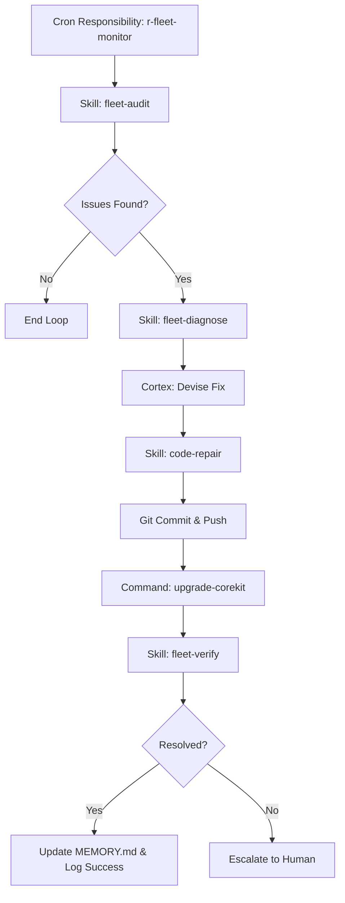

# Plan: Automated Fleet Agent Improvement via Prime Agent

This plan outlines how to configure a **Prime Agent** (e.g., `prime-candicejr`) with the capabilities, responsibilities, and custom skills required to automatically monitor, diagnose, and improve the fleet agents operating under its control.

---

## 1. Architecture Overview

To enable a Prime Agent to manage and improve its fleet agents, we implement a closed-loop control system:



---

## 2. Configuration Elements

### A. Responsibility Definition (Cron-Triggered)
We define a new responsibility for the Prime agent to trigger a regular health check of its fleet.

#### `corekit/config/responsibilities/r-fleet-agent-monitor.json`
```json
{
  "id": "r-fleet-agent-monitor",
  "cron": "0 */4 * * *",
  "description": "Scans fleet agents for service failures, log errors, and stuck missions every 4 hours.",
  "instruction": "Run the p-fleet-agent-improvement process to inspect all fleet VM statuses, read logs for errors or ignored messages, diagnose root causes, write code/config patches, deploy the upgrade, and verify recovery."
}
```

### B. Process Definition (Step-by-Step Recipe)
We define a deterministic process to guide the Cerebellum and Cortex through the audit-repair loop.

#### `corekit/config/processes/p-fleet-agent-improvement.json`
```json
{
  "id": "p-fleet-agent-improvement",
  "title": "Automated Fleet Agent Audit, Repair, and Upgrade Process",
  "steps": [
    {
      "name": "Audit Fleet Status",
      "instruction": "Retrieve VM list and run systemctl status checks on ears, brain, and mouth services for each fleet agent."
    },
    {
      "name": "Analyze Logs",
      "instruction": "Read the last 100 lines of system logs on any service that is failing, or any ears logs showing 'count: 0' or 'resolution failed' for GChat spaces."
    },
    {
      "name": "Formulate Diagnosis",
      "instruction": "Determine the root cause (e.g. permission error, missing scope, incorrect mention matching, ES syntax error)."
    },
    {
      "name": "Apply Fixes",
      "instruction": "Modify the relevant CoreKit daemon script, custom skill guide, or system configuration in the local repository."
    },
    {
      "name": "Verify Syntax & Commit",
      "instruction": "Run local syntax verification, stage modifications, and commit with a standard version tag (e.g. vYYYY.MM.DD.X.Y), then push to main."
    },
    {
      "name": "Deploy Upgrade",
      "instruction": "Execute upgrade-corekit via SSH on the target fleet VM to apply the main branch updates."
    },
    {
      "name": "Verify Recovery",
      "instruction": "Inspect VM logs and verify that the failing service starts successfully, or that the missed message is ingested and processed."
    }
  ]
}
```

### C. Specialty Skills
The Prime Agent requires specific tools and permissions, packaged as a workspace skill.

#### `skills/fleet-agent-debugging/SKILL.md`
- **When to Use**: When a fleet agent is not responding to GChat, or service logs report errors.
- **Commands**:
  - `gcloud compute ssh fleet-{name} --command="systemctl status agent-ears"` (Checks service status).
  - `gcloud compute ssh fleet-{name} --command="tail -n 100 /var/log/agent-ears.log"` (Ears input logs).
  - `gcloud compute ssh fleet-{name} --command="sudo /opt/corekit/bin/upgrade-corekit --apply main"` (Upgrades the target VM).
- **Procedures**:
  - Outlines exact search patterns (e.g., searching for `error`, `failed`, or `unauthorized`).
  - Instructs how to safely perform code modifications in the parent repository without breaking local state.

---

## 3. Human Escalation Gates

To prevent automated loops from creating unstable deployments or infinite git commits, the Prime agent will:
1. **Limit Retries**: If the same service fails to recover after one automated repair attempt, the process aborts.
2. **Open Approval Gates**: Major code changes (outside of documentation/skill updates) must generate a Firestore approval request under `primes/{PRIME_ID}/approvals` to request human sign-off before git push/deployment.
3. **Notify on GChat**: Send a direct message to the admin GChat space detailing the failure, the attempted fix, and the diagnostic logs.
