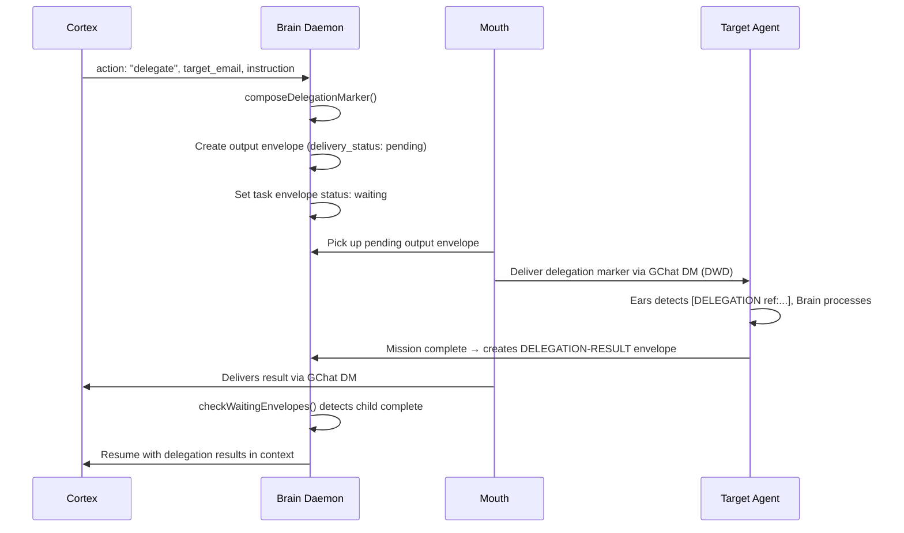

# Team Members & Delegation

How project teams are structured, how Cortex selects delegation targets, and how delegation flows through Mouth.

## Team Member Schema

Each project carries a `team` array of members:

```json
{
  "email": "swe-agent-bobby@tachin.ag",
  "role": "engineer",
  "name": "Bobby",
  "type": "agent"
}
```

| Field | Description |
|-------|-------------|
| `email` | Agent or human email — used as GChat delivery target |
| `role` | Specialty: `engineer`, `architect`, `analyst`, `owner`, etc. |
| `name` | Display name for human-readable markers |
| `type` | `agent` or `human` — determines delivery expectations |

## Managing Team Members

All operations use the `project-manage` motor tool:

```bash
# Add a team member
project-manage team-add '<projectId>' '{"email":"bobby@tachin.ag","role":"engineer","name":"Bobby","type":"agent"}'

# Remove a team member
project-manage team-remove '<projectId>' 'bobby@tachin.ag'

# List team members (included in project-manage get output)
project-manage get '<projectId>'
```

## How Cortex Selects Delegation Targets

When Cortex receives a decide payload, project context includes the `team` array. Cortex matches work to a teammate by:

1. **Role match** — Does the work require a specialty a teammate has? (e.g., implementation → `engineer`)
2. **Type preference** — Agent teammates are preferred for automated work; humans for approval gates
3. **Availability** — Cortex checks `active_envelopes` to avoid overloading a busy agent

If no suitable team member exists, brain falls back to fleet-wide specialty lookup via agent registry.

## Delegation Flow



### Key invariant

**No organ ever calls `chat-send` for delegation.** Brain creates output envelopes; Mouth delivers them. This is Brain Canon B-9 — Mouth is the sole outbound channel.

## Example: Architect Delegates to Engineer

Project `proj-self-improvement` has team members:
- Archie (`archie@tachin.ag`) — architect
- Bobby (`bobby@tachin.ag`) — engineer

**Scenario:** Archie's mission is "Improve the project README." Archie researches best practices and decides the actual writing belongs to Bobby.

Cortex returns:
```json
{
  "action": "delegate",
  "target_email": "bobby@tachin.ag",
  "instruction": "Write a comprehensive README.md for proj-self-improvement. Include: project purpose, setup instructions, architecture overview, and contribution guide. Use the research notes in shared/w-abc123/research.md.",
  "accept_criteria": "README.md exists in repo root with all four sections, passes markdown lint",
  "project_id": "proj-self-improvement"
}
```

Brain composes the delegation marker, creates an output envelope, and Mouth delivers it to Bobby's GChat DM. Archie's mission enters `waiting`. When Bobby completes the README, his brain creates a `DELEGATION-RESULT` envelope. Mouth delivers it back, Archie's brain resumes, and Cortex synthesizes the final result.

## Related Docs

- [DELEGATION_PROTOCOL.md](./DELEGATION_PROTOCOL.md) — Wire format, dedup guards, resume mechanism
- [BRAIN_CANON.md](../BRAIN_CANON.md) — B-9 organ boundaries, B-11 legal moves
