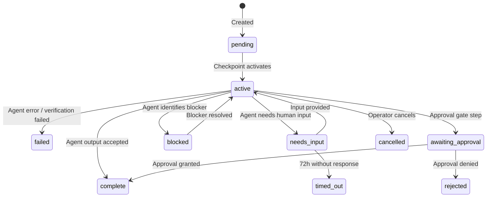

# Primitive: Task

**WorkEnvelope type:** `T`
**Firestore path:** `primes/{primeId}/work/{taskId}`

The Task is the **atomic unit of work** in the Culture of Work. Every Task is dispatched to exactly one agent (motor, cerebellum, temporal-research, etc.) and produces a single output. Tasks do not plan, decompose, or create other work items.

---

## Fields

| Field | Type | Description |
|-------|------|-------------|
| `id` | `string` | Unique identifier (generated via `generateId('w')`) |
| `type` | `'T'` | Always `'T'` for Tasks |
| `parent_id` | `string` | ID of the parent Checkpoint envelope |
| `owner` | `string` | Agent email or ID that owns this task |
| `status` | `string` | Current lifecycle status (see below) |
| `intent` | `string` | Dispatch intent: `'execute'`, `'research'`, `'approval_gate'` |
| `title` | `string` | Short human-readable title (LLM-generated) |
| `instruction` | `string` | Full instruction for the agent |
| `accept_criteria` | `string` | What constitutes successful completion |
| `context_summary` | `string \| null` | Forwarded context from prior steps |
| `output` | `string \| null` | Agent's output (set on completion) |
| `error` | `string \| null` | Error message (set on failure) |
| `children` | `string[]` | Always `[]` for Tasks (leaf nodes) |
| `source_channel` | `string` | Origin: `'dashboard'`, `'chat'`, `'scheduler'`, `'plan'`, `'system'` |
| `source_meta` | `Record<string, unknown>` | Step metadata from the agent's checkpoint_plan |
| `project_id` | `string \| null` | Inherited from parent Mission |
| `plan_id` | `string \| null` | If created from a Plan stamp |
| `created_at` | `string` | ISO 8601 timestamp |
| `started_at` | `string \| null` | When execution began |
| `completed_at` | `string \| null` | When execution finished |
| `updated_at` | `string` | Last update timestamp |
| `iteration` | `number` | Dispatch iteration counter |
| `blocker` | `string \| null` | Blocker description (when `status: 'blocked'`) |
| `blocker_type` | `string \| null` | Blocker category |
| `blocked_at` | `string \| null` | When blocker was set |

### `source_meta` for Plan-Derived Tasks

When a Task is stamped from the agent's checkpoint_plan, `source_meta` carries:

```json
{
  "step_type": "standard",        // "standard" | "approval_gate"
  "step_index": 0,                // Index within the checkpoint
  "checkpoint_index": 0,          // Parent checkpoint index
  "agent": "motor",               // Target agent for dispatch
  "optional": false,              // If true, failure doesn't fail the checkpoint
  "specialty": null,              // Required agent specialty (if any)
  "approval_message": null        // Custom approval message (for approval_gate)
}
```

---

## Lifecycle



### Key Transitions

1. **Created → pending**: Task stamped as part of M→C→T hierarchy
2. **pending → active**: Parent Checkpoint begins executing this Task
3. **active → complete**: Agent produces output meeting accept criteria
4. **active → failed**: Agent hits error, max iterations, or cerebellum rejects output
5. **active → awaiting_approval**: Task is an `approval_gate` step

---

## Dispatch

The brain daemon dispatches Tasks to agents via HTTP calls to the neural gateway:

1. Task is activated by the daemon when its parent Checkpoint begins
2. `callAgent(agentId, payload)` sends the instruction to the target agent
3. Agent executes and returns a response
4. Cerebellum verifies the output against `accept_criteria` (for standard dispatches)
5. On success: Task marked `complete`, output stored
6. On failure: Task marked `failed`, error stored, checkpoint fails (unless `optional: true`)

### Intent Types

| Intent | Behavior |
|--------|----------|
| `execute` | Full execution — agent may modify files, run commands, create resources |
| `research` | Read-only — agent examines systems but must not modify anything |
| `approval_gate` | Not dispatched to an agent — pauses for human approval |

---

## Examples

### Standard Execution Task
```json
{
  "id": "w-abc123",
  "type": "T",
  "parent_id": "w-cp456",
  "status": "active",
  "intent": "execute",
  "title": "Implement login validation",
  "instruction": "Add email format validation to the login form...",
  "accept_criteria": "Email validation rejects invalid formats. Tests pass.",
  "source_meta": {
    "step_type": "standard",
    "agent": "motor",
    "optional": false
  }
}
```

### Research Task
```json
{
  "id": "w-def789",
  "type": "T",
  "parent_id": "w-cp456",
  "status": "active",
  "intent": "research",
  "title": "Scan for security vulnerabilities",
  "instruction": "⚠️ READ-ONLY — scan the auth module for...",
  "accept_criteria": "All files scanned. Findings documented. No files modified.",
  "source_meta": {
    "step_type": "standard",
    "agent": "motor",
    "optional": false
  }
}
```
