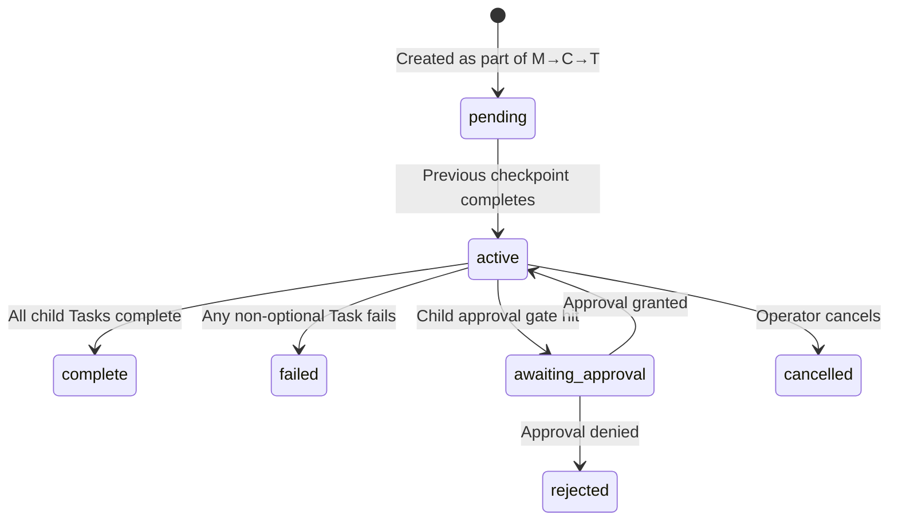

# Primitive: Checkpoint

**WorkEnvelope type:** `C`
**Firestore path:** `primes/{primeId}/work/{checkpointId}`

A Checkpoint **groups related Tasks** into a logical unit with its own accept criteria. Checkpoints execute sequentially within a Mission — all Tasks in Checkpoint 1 must complete before Checkpoint 2 begins. Verification happens at checkpoint boundaries.

---

## Fields

| Field | Type | Description |
|-------|------|-------------|
| `id` | `string` | Unique identifier (generated via `generateId('w')`) |
| `type` | `'C'` | Always `'C'` for Checkpoints |
| `parent_id` | `string` | ID of the parent Mission envelope |
| `owner` | `string` | Agent email or ID |
| `status` | `string` | Current lifecycle status |
| `intent` | `'checkpoint'` | Always `'checkpoint'` |
| `title` | `string` | Short human-readable title (LLM-generated) |
| `instruction` | `string` | What this checkpoint accomplishes |
| `accept_criteria` | `string` | Overall checkpoint success criteria |
| `output` | `string \| null` | Aggregated output from child Tasks |
| `error` | `string \| null` | Error details on failure |
| `children` | `string[]` | Array of child Task IDs |
| `context_forward` | `string \| null` | Context forwarded to subsequent checkpoints |
| `source_channel` | `string` | Origin channel |
| `source_meta` | `Record<string, unknown>` | Metadata (plan_id, checkpoint index, etc.) |
| `project_id` | `string \| null` | Inherited from parent Mission |
| `plan_id` | `string \| null` | If created from a Plan stamp |
| `process_id` | `string \| null` | Source process ID |
| `created_at` | `string` | ISO 8601 timestamp |
| `started_at` | `string \| null` | When first Task begins |
| `completed_at` | `string \| null` | When all Tasks finish |
| `updated_at` | `string` | Last update timestamp |
| `iteration` | `number` | Not used for checkpoints (always `0`) |

---

## Lifecycle



### Checkpoint Sequencing


1. Mission starts → **Checkpoint 1** activates → its Tasks execute sequentially
2. All CP1 Tasks complete → CP1 status becomes `complete`
3. **Checkpoint 2** activates → its Tasks execute sequentially
4. Pattern continues until all Checkpoints complete → Mission completes

### Context Forwarding

When a Checkpoint completes, context from its Tasks is forwarded to the next Checkpoint. This is how later steps know what earlier steps accomplished. The brain daemon manages context budgets:

- Success context: budget per prior step governed by `utility.context_budgets.dispatch_success` in `contracts.json`
- Failure context: budget per prior step governed by `utility.context_budgets.dispatch_failure` in `contracts.json`

---

## Checkpoint Boundaries in Processes

In Process definitions, the `checkpointBoundary` field on a step marks where one Checkpoint ends and the next begins. Steps between boundaries are grouped into the same Checkpoint.

```json
{
  "title": "Validate implementation",
  "description": "Run tests and lint checks...",
  "agent": "motor",
  "accept_criteria": "All tests pass.",
  "checkpointBoundary": true     // ← This step ends the current checkpoint
}
```

Steps without `checkpointBoundary: true` accumulate into the current Checkpoint. The final step always ends a checkpoint (implicitly).

### Grouping Example

Given 5 process steps where steps 2 and 4 have `checkpointBoundary: true`:

| Step | checkpointBoundary | Checkpoint |
|------|:---:|:---:|
| Step 1 | — | CP 1 |
| Step 2 | ✓ | CP 1 |
| Step 3 | — | CP 2 |
| Step 4 | ✓ | CP 2 |
| Step 5 | — (final) | CP 3 |

---

## Verification happens at the checkpoint boundary

Verification is a **checkpoint-level** concern, not a per-Task one. Individual Tasks are
**self-verified** by the organ that executes them — the organ confirms its own output before
reporting the Task complete. After all Tasks in a Checkpoint complete, the brain daemon
dispatches **cerebellum** once to judge the combined output against the Checkpoint's
`accept_criteria` — a single, higher-level judgment of whether the *milestone* was achieved.

A Checkpoint is the unit of verification precisely because it is a **verifiable milestone**;
a Task is just a step toward it. So a Checkpoint's `accept_criteria` must state the observable
**outcome** at the milestone (what is true when it's done), not the per-step mechanics of how
the organ got there. Verification is a judgment call — true to life — made once per milestone,
not a mechanical gate on every step.

---

## Example

```json
{
  "id": "w-cp456",
  "type": "C",
  "parent_id": "w-mission789",
  "status": "active",
  "intent": "checkpoint",
  "title": "Implementation & validation",
  "instruction": "Checkpoint 2: Implement changes and validate with tests",
  "accept_criteria": "All changes implemented. Tests pass. Lint clean.",
  "children": ["w-task-a", "w-task-b", "w-task-c"],
  "source_meta": {
    "plan_id": "plan-xyz",
    "checkpoint": 2,
    "checkpoint_total": 3
  },
  "project_id": "proj-123"
}
```
