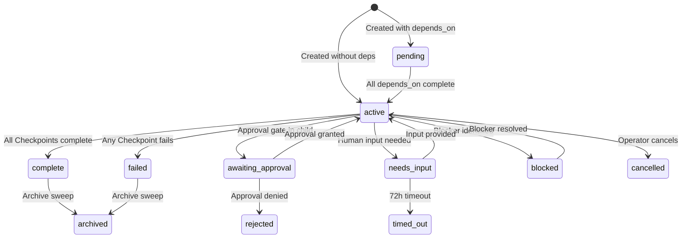

# Primitive: Mission

**WorkEnvelope type:** `M`
**Firestore path:** `work/{missionId}`

A Mission is a **self-contained goal** with accept criteria, containing one or more Checkpoints. Missions are the primary unit of visible work — they appear in the Work Tree dashboard and always belong to a Project.

Missions live in the **top-level `work/` collection**, not under a Prime subcollection. Each Mission carries locating fields — `project_id` (required), `owner` (the executing agent), and `prime_id` (denormalized, for dashboard filtering) — so the brain finds its work by querying `work where owner == self`.

---

## Fields

| Field | Type | Description |
|-------|------|-------------|
| `id` | `string` | Unique identifier (generated via `generateId('w')`) |
| `type` | `'M'` | Always `'M'` for Missions |
| `parent_id` | `string \| null` | Parent Responsibility ID, or `null` for ad-hoc |
| `owner` | `string` | Agent email or ID |
| `status` | `string` | Current lifecycle status |
| `intent` | `string` | `'execute'`, `'plan_execution'`, etc. |
| `title` | `string` | Short human-readable title (LLM-generated) |
| `instruction` | `string` | What the mission should accomplish (goal, not steps) |
| `accept_criteria` | `string` | What constitutes successful completion |
| `context_summary` | `string \| null` | Context provided at creation |
| `output` | `string \| null` | Final synthesized output |
| `error` | `string \| null` | Error details on failure |
| `children` | `string[]` | Array of child Checkpoint IDs |
| `depends_on` | `string[]` | Mission IDs this Mission depends on |
| `source_channel` | `string` | `'dashboard'`, `'chat'`, `'scheduler'`, `'plan'`, `'system'` |
| `source_meta` | `Record<string, unknown>` | Metadata (responsibility_id, plan_id, etc.) |
| `project_id` | `string` | **Required.** Project this Mission belongs to. |
| `plan_id` | `string \| null` | If created from a Plan stamp |
| `process_id` | `string \| null` | ID of a playbook recalled into planning, if any |
| `process_version` | `number \| null` | Version of the recalled playbook, if any |
| `delivery_status` | `string \| null` | `'internal'`, `'delivered'`, etc. |
| `memory_context` | `object \| null` | Recalled memory at creation time |
| `context` | `object \| null` | Merged context packets |
| `source_text` | `string \| null` | Raw user message (preserved verbatim) |
| `created_at` | `string` | ISO 8601 timestamp |
| `started_at` | `string \| null` | When execution began |
| `completed_at` | `string \| null` | When execution finished |
| `updated_at` | `string` | Last update timestamp |
| `iteration` | `number` | Brain iteration counter |

---

## Lifecycle



---

## Creation Paths

Missions are created through several code paths:

### 1. Cortex Decide Loop (the primary path)

When cortex plans work directly. If the intake resembles a known playbook, that narrative is recalled
into the planning context as a prior; the cortex still plans its own checkpoints (C-15).

```
Input → cortex classify → new_mission → cortex checkpoint_plan (playbook recalled if matched) → M→C→T stamped
```

### 2. Responsibility Firing (`fireResponsibility`)

When a cron schedule triggers:

```
Cron → fireResponsibility() → R envelope → M (cortex-planned) → M→C→T stamped
```

---

## The `project_id` Rule

**Every Mission must have a `project_id`.** This is enforced at write time.

Resolution order:
1. Explicit `project_id` from cortex classification or decision
2. `resp.project_id` from Responsibility definition
3. Plan's `project_id`
4. Parent Mission's `project_id` (for attached work)
5. `DEFAULT_PROJECT_ID` (`general`) — always available

---

## Dependency Management

### Declaring Dependencies

```json
{
  "id": "w-mission-B",
  "type": "M",
  "status": "pending",
  "depends_on": ["w-mission-A"],
  "instruction": "Deploy the feature (after tests pass)"
}
```

### Evaluation

- `checkDependencies(envelope)` returns `true` when all `depends_on` targets are `complete` or `archived`
- **Fails open**: if a dependency can't be found or an error occurs, the Mission is not blocked
- Circular dependencies are rejected at write time

### Auto-Activation

When any Mission completes:
1. `activateDependents(completedMissionId)` scans all `pending` Missions
2. For each that lists the completed Mission in `depends_on`:
   - Re-check all dependencies
   - If all met → transition to `active`, set `started_at`
   - Write history entry: "Dependencies cleared — auto-activated"

---

## Example

### Mission (playbook recalled)

```json
{
  "id": "w-abc123",
  "type": "M",
  "parent_id": null,
  "status": "active",
  "intent": "execute",
  "title": "Implement user authentication",
  "instruction": "Add JWT-based authentication to the API...",
  "accept_criteria": "JWT authentication implemented, tested, and merged to main.",
  "children": ["w-cp1", "w-cp2", "w-cp3"],
  "depends_on": [],
  "project_id": "proj-auth-v2",
  "process_id": "p-plan",
  "process_version": 4,
  "plan_id": null,
  "delivery_status": "internal"
}
```

### Mission with Dependencies

```json
{
  "id": "w-deploy-456",
  "type": "M",
  "status": "pending",
  "depends_on": ["w-abc123", "w-tests-789"],
  "instruction": "Deploy authentication feature to staging",
  "project_id": "proj-auth-v2"
}
```
