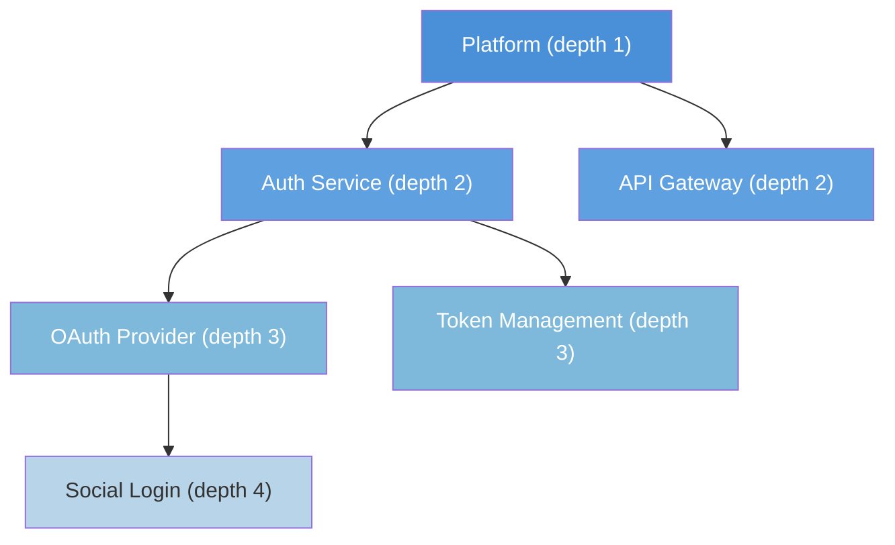
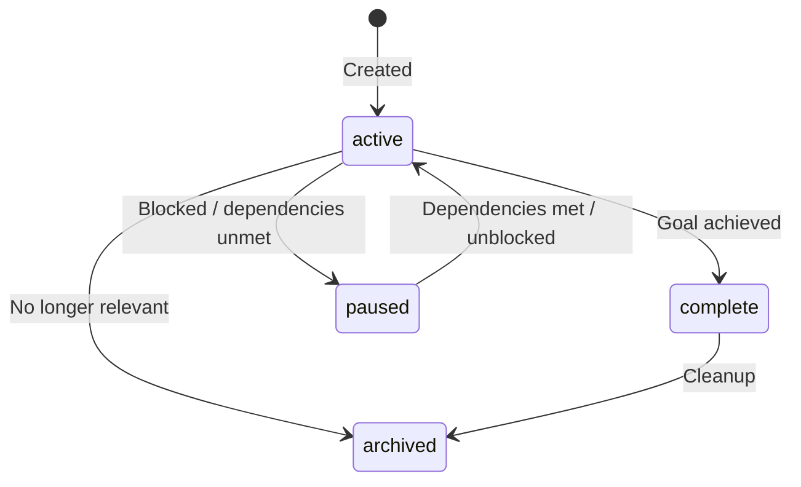
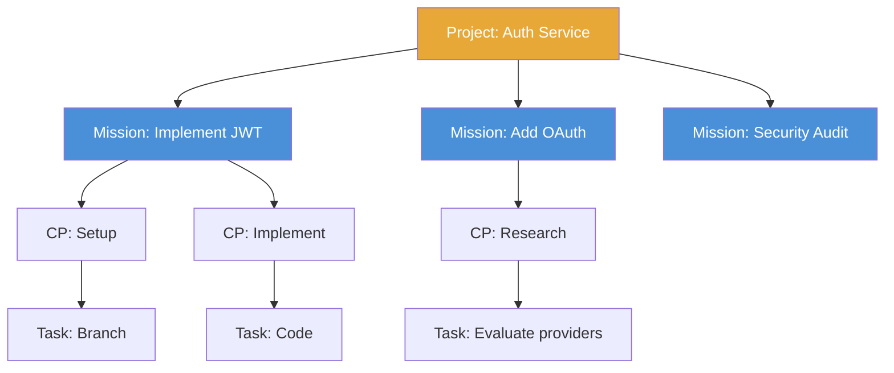

# Primitive: Project

**Firestore path:** `projects/{projectId}`

A Project is the **organizational container** for Missions. Projects are deployment-rooted — they live in the top-level `projects/` collection, shared across all agents in the deployment and orchestrated via the dashboard. Projects are recursive (parent/child), carry accumulated context, and support dependency management between sibling projects. They are not WorkEnvelopes.

---

## Fields

| Field | Type | Description |
|-------|------|-------------|
| `id` | `string` | Unique identifier |
| `name` | `string` | Human-readable project name |
| `goal` | `string` | What this project aims to accomplish |
| `description` | `string` | Detailed description |
| `owner` | `string` | Agent or user who owns this project |
| `status` | `'active' \| 'complete' \| 'paused' \| 'archived'` | Current state |
| `parent_id` | `string \| null` | Parent project ID for nesting (`null` = top-level) |
| `depends_on` | `string[]` | Project IDs this project depends on |
| `context` | `ProjectContext \| null` | Accumulated context (see below) |
| `created_at` | `string` | ISO 8601 timestamp |
| `updated_at` | `string` | Last update timestamp |

### ProjectContext — the 40,000-ft working-area view (C-28)

A project is the **40,000-foot view** of a working area: what it is, who works it, the
durable resources it lives in, and the playbooks it suggests. It is **not** a mission ledger.
`context` is a curated map of **durable resource references only** — keyed by a semantic
slug, each value a resource packet:

```typescript
context: Record<string /* semantic slug */, {
  kind: 'drive_folder' | 'doc' | 'sheet' | 'slides' | 'url' | 'repo' | 'git' | 'resource' | 'convention';
  ref?: string;      // resource id (Drive folder id, repo, doc id)
  url?: string;      // stable URL (staging/prod)
  summary?: string;  // one-line durable fact (a lasting convention, an access requirement)
  updatedAt?: string; updatedBy?: string;
}>
```

**What context holds:** the Drive folder / repo / doc a working area lives in, a stable
staging/prod URL, a lasting working convention (an always-required build step, an access
requirement). **What it NEVER holds** (→ where it belongs): a specific mission's document id
or one-off result (→ the Mission record / an Artifact); history or a failure that happened
(→ nowhere, or a Process learning if repeatable); transient state like "repo is at commit X"
(→ nowhere); a workflow or how-to pattern (→ a **Process** playbook, as a narrative); tool syntax (→ a **Skill**).

**References to relevant playbooks** are the top-level **`standardProcesses: string[]`** field
(process IDs), not context — managed with the `--processes` flag / `add-process`. This is how a
project **suggests** the playbooks relevant to it: their narratives are recalled into an agent's own
plan as priors when the work matches — never executed as step-processes.

Enforcement: every writer of `context` passes it through the single validator
`corekit/lib/project-context.mjs` (`validateContextEntry` / `filterProjectContext`), which
rejects off-layer keys, non-resource values, and caps the map size. See
[MODULE_CHARTER](../MODULE_CHARTER.md) and PRODUCT_CANON **C-28**.

> The older typed `{documentation, processes, team, configuration}` shape is superseded by
> this slug-packet map plus the top-level `team` and `standardProcesses` fields.

---

## Recursive Structure

Projects nest via `parent_id` with a **maximum depth of 4 levels**.



### Depth Enforcement

- `validateProjectDepth()` rejects nesting beyond 4 levels at write time
- Attempting to create a project at depth 5 returns an error

### Context Accumulation

When building context for a Mission, the engine traverses the parent chain and merges context. **Most specific wins** — a child project's context overrides a parent's for the same keys.

```
buildProjectContext(projectId):
  1. Load project
  2. If parent_id → recurse to build parent context
  3. Merge: parent context ← child context (child wins)
  4. Return accumulated context
```

---

## Status Transitions



### Automatic Completion

When all child Missions and sub-Projects complete:
- If `projects.promotion_auto` is `true` in contracts: auto-complete
- Otherwise: flag for PM review

### Dependency Behavior

A Project with `depends_on` stays `paused` until all dependency Projects are `complete` or `archived`.

---

## Default Project

Every deployment has a **default project** created automatically at startup:

```
ID: general
Goal: "General workspace"
Status: active
Parent: null
```

This ensures the `project_id` enforcement rule is always satisfiable — even when no named project applies, the default project is used.

---

## Project ↔ Mission Relationship



- Every Mission **must** reference a `project_id`
- A Project can have many Missions
- Missions inherit project context for their agents

---

## Example

```json
{
  "id": "proj-auth-v2",
  "name": "Authentication V2",
  "goal": "Migrate from session-based to JWT authentication",
  "description": "Complete overhaul of the auth system...",
  "owner": "stan@example.com",
  "status": "active",
  "parent_id": "proj-platform",
  "depends_on": [],
  "team": [
    {"email": "stan@example.com", "role": "lead", "name": "Stan", "type": "agent"},
    {"email": "alex@example.com", "role": "reviewer", "name": "Alex", "type": "human"}
  ],
  "standardProcesses": ["p-plan", "p-review"],
  "context": {
    "auth-spec": {"kind": "doc", "ref": "1AbC...", "summary": "Auth specification"},
    "repo": {"kind": "git", "ref": "proj-auth-v2", "summary": "Auth service artifact repo"},
    "staging": {"kind": "url", "url": "https://staging.example.com", "summary": "Staging environment"}
  },
  "created_at": "2026-06-01T10:00:00Z",
  "updated_at": "2026-06-08T14:00:00Z"
}
```

## Repo Mapping
Every project maps to exactly one git artifact repo (repo-per-project convention C-24).
The repo ID is the project ID sanitized to `[a-z0-9-]` (via `sanitizeRepoId`). Cross-project
access is granted via explicit `work-clone`.

### `merge_policy`
- `auto` (default) — mission branches merge to `main` automatically on completion
- `gated` — merge requires explicit approval via the approval gate before landing on `main`

Resolution: project-level `merge_policy` if set, else `auto`.
