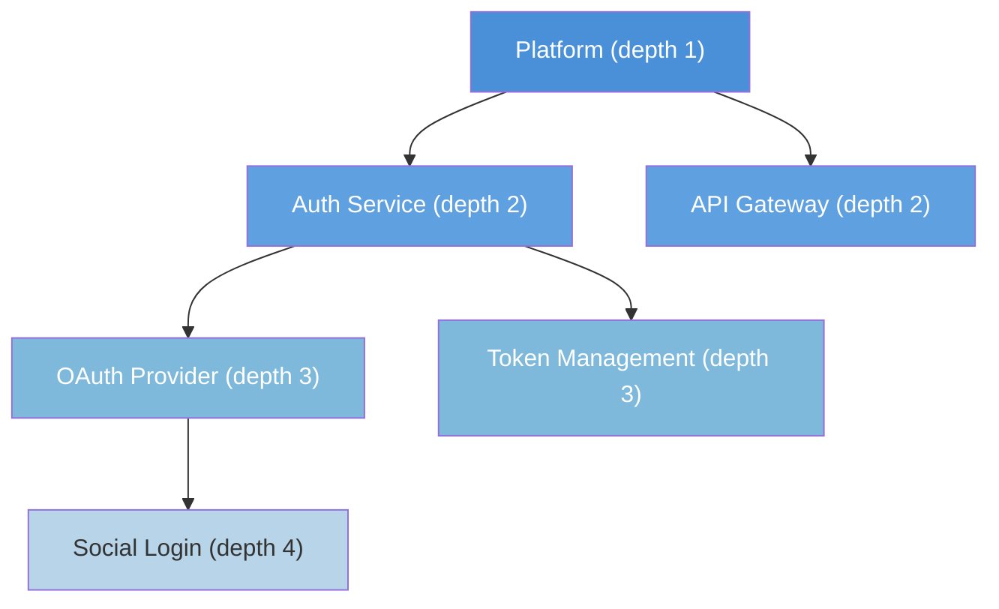
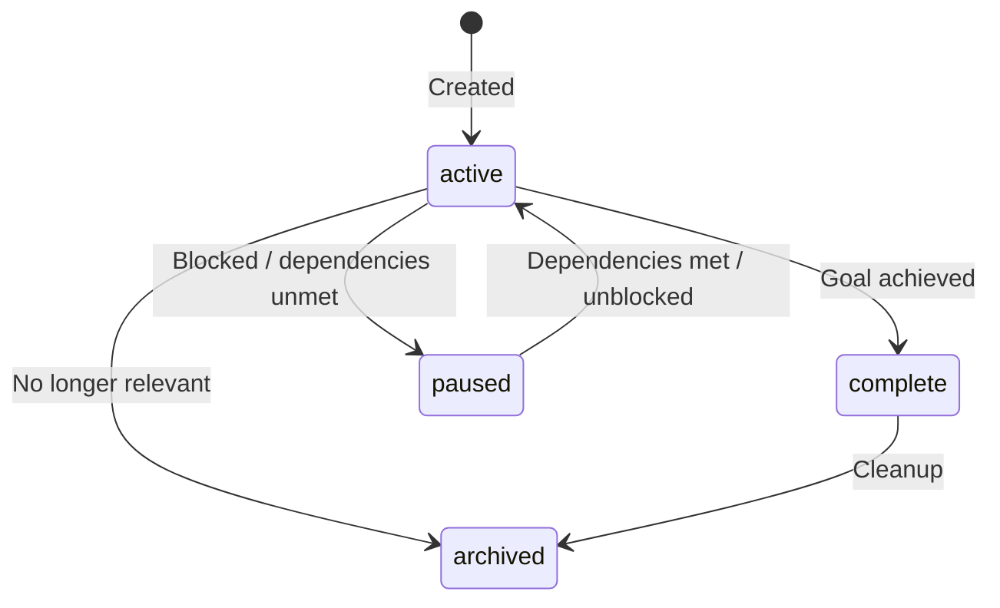
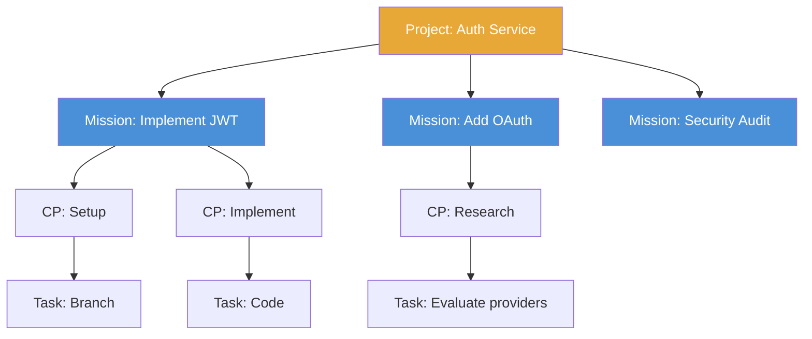

# Primitive: Project

**Firestore path:** `primes/{primeId}/projects/{projectId}`

A Project is the **organizational container** for Missions. Projects are recursive (parent/child), carry accumulated context, and support dependency management between sibling projects. They are not WorkEnvelopes — they live in their own Firestore collection.

---

## Fields

| Field | Type | Description |
|-------|------|-------------|
| `id` | `string` | Unique identifier |
| `name` | `string` | Human-readable project name |
| `goal` | `string` | What this project aims to accomplish |
| `description` | `string` | Detailed description |
| `owner` | `string` | Agent or user who owns this project |
| `status` | `'active' \| 'complete' \| 'paused' \| 'archived'` | Current state |
| `parent_id` | `string \| null` | Parent project ID for nesting (`null` = top-level) |
| `depends_on` | `string[]` | Project IDs this project depends on |
| `context` | `ProjectContext \| null` | Accumulated context (see below) |
| `created_at` | `string` | ISO 8601 timestamp |
| `updated_at` | `string` | Last update timestamp |

### ProjectContext

```typescript
{
  documentation: string[];              // Paths or URLs to relevant docs
  processes: string[];                  // Process IDs relevant to this project
  team: Record<string, string>;         // Role → agent/user mappings
  configuration: Record<string, unknown>; // Project-specific config values
}
```

---

## Recursive Structure

Projects nest via `parent_id` with a **maximum depth of 4 levels**.



### Depth Enforcement

- `validateProjectDepth()` rejects nesting beyond 4 levels at write time
- Attempting to create a project at depth 5 returns an error

### Context Accumulation

When building context for a Mission, the engine traverses the parent chain and merges context. **Most specific wins** — a child project's context overrides a parent's for the same keys.

```
buildProjectContext(projectId):
  1. Load project
  2. If parent_id → recurse to build parent context
  3. Merge: parent context ← child context (child wins)
  4. Return accumulated context
```

---

## Status Transitions



### Automatic Completion

When all child Missions and sub-Projects complete:
- If `projects.promotion_auto` is `true` in contracts: auto-complete
- Otherwise: flag for PM review

### Dependency Behavior

A Project with `depends_on` stays `paused` until all dependency Projects are `complete` or `archived`.

---

## Default Project

Every agent has a **default project** created automatically at startup:

```
ID: {agent-id}/general
Goal: "General workspace"
Status: active
Parent: null
Owner: {agent-id}
```

This ensures the `project_id` enforcement rule is always satisfiable — even when no named project applies, the default project is used.

---

## Project ↔ Mission Relationship



- Every Mission **must** reference a `project_id`
- A Project can have many Missions
- Missions inherit project context for their agents

---

## Example

```json
{
  "id": "proj-auth-v2",
  "name": "Authentication V2",
  "goal": "Migrate from session-based to JWT authentication",
  "description": "Complete overhaul of the auth system...",
  "owner": "stan@company.com",
  "status": "active",
  "parent_id": "proj-platform",
  "depends_on": [],
  "context": {
    "documentation": ["/docs/auth-spec.md", "/docs/jwt-rfc.md"],
    "processes": ["p-plan", "p-review"],
    "team": {
      "lead": "stan@company.com",
      "reviewer": "alex@company.com"
    },
    "configuration": {
      "token_expiry": "15m",
      "refresh_strategy": "sliding"
    }
  },
  "created_at": "2026-06-01T10:00:00Z",
  "updated_at": "2026-06-08T14:00:00Z"
}
```
