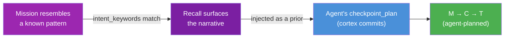

# Primitive: Process

**Firestore path:** `processes/{processId}` (one global, tenant-wide library at the database root)
**Disk path:** `corekit/config/processes/{processId}.json` (seed narratives only)

A Process is a **narrative playbook** — a named, remembered account of *how a recurring kind of
work has been done well before*. It is not a program the daemon executes; it is a **prior the agent
consults**. When a mission resembles a known pattern, the playbook's narrative is recalled and
injected into the agent's planning context ("here's how we've done this well — adapt it, keep full
control"). The narrative **guides**; it never dispatches.

A process is the **sibling of a skill**. A skill teaches *how to drive a tool* — tool syntax, flags,
procedure. A process narrates *what has worked* for a kind of work — a contextual pattern, carrying
**no tool syntax**. Both are reusable know-how; they differ in what they hold.

| | **Skill** | **Process (playbook)** |
|---|---|---|
| Teaches | HOW to drive a tool / do a generic task | WHAT has worked for a recurring kind of work |
| Content | tool syntax, flags, procedure | a contextual narrative — no tool syntax |
| Scope | role-generic | project / context specific |
| Author | the repo (shipped, manifest-installed) | the agent (remembered, evolved in the living store) |

---

## The shape

A process is exactly **name + short description + narrative**, plus the cues and status that let it
be recalled and curated. Nothing else — no `steps`, no `parameters`, no `contextTemplate`, no
per-step agent, no checkpoint boundaries, no approval gates.

```json
{
  "id": "p-investigate",
  "name": "Investigation",
  "description": "How we diagnose an issue or answer a question — read-only, evidence-first.",
  "narrative": "An investigation examines; it never fixes. Frame the precise question and scope first, then gather the real evidence — logs, code paths, config, live state — without touching anything. Weigh it against your hypotheses, separating what you verified from what you are still guessing. Close with findings, the root cause if you have it, and a recommendation. Keep the read-only line: diagnosing is not deploying.",
  "intent_keywords": ["not working", "broken", "failing", "diagnose", "debug", "why", "error", "investigate"],
  "status": "active",
  "version": 4
}
```

### Fields

| Field | Type | Description |
|-------|------|-------------|
| `id` | `string` | Unique identifier (e.g. `p-investigate`) |
| `name` | `string` | Human-readable handle (e.g. `Investigation`, `Plan and Build`) |
| `description` | `string` | One line: what kind of work this is and when it's relevant — the registry line the cortex sees |
| `narrative` | `string` | Tool-syntax-free prose: the shape that works, the order, what to watch for, what **not** to do |
| `intent_keywords` | `string[]` | Cue terms that surface this playbook when a mission resembles the pattern (drives recall matching) |
| `status` | `'active' \| 'deprecated'` | `active` — recalled into planning. `deprecated` — retired (soft delete; no longer recalled) |
| `version` | `number` | Bumped on each refinement |

The living store additionally stamps `updated_by` / `updated_at` on every write, and a playbook may
carry optional `tags` (and a `project` tag) so it can be scoped to a context while still living in the
one shared library. These are store metadata, not part of the authored shape above.

### What a process holds — and what it must not (C-28)

A process holds **wisdom in prose**: the disposition and pattern of a kind of work, written the way a
seasoned teammate would tell you "here's how this usually goes well." It reads like remembered
experience, not a runbook or a tool transcript.

| A process HOLDS | It must NEVER hold → belongs to |
|---|---|
| a contextual narrative ("frame the question first, gather real evidence, separate verified from guessed") | tool syntax / a command / flags → the **Skill** |
| a pattern's disposition ("keep the read-only line; diagnosing is not deploying") | agent voice, emoji, persona → the **Mouth** voices delivery |
| the shape and order that has worked, as prose to adapt | a rigid step list, agent-per-step, checkpoint/approval gates → **the agent's own plan** |
| cue keywords for recall | an operator particular (a firebase id, a bucket, a URL) → the **Project** context or the Mission |

See [MODULE_CHARTER](../MODULE_CHARTER.md) and PRODUCT_CANON **C-28**.

---

## The mechanism — a process is planning CONTEXT, not an execution path

There is **one** way work gets structured: the agent's own `checkpoint_plan`. A process never becomes
a second, competing way to run work.



1. **Match.** A lightweight registry (name + one-line description) tells the cortex which playbooks
   exist; `intent_keywords` and the recall corpus surface a relevant one when the work resembles it.
2. **Recall.** The full narrative loads on demand and is injected into the planning context as a
   prior — *"here's how we've done this well before."*
3. **Plan.** The cortex plans its own checkpoints and tasks with full iterative control (re-plan,
   adjust, manage the spine). The narrative informs the plan; it does not dictate it.

Because the only path that structures work is the agent's own planning, **maximum iterative control
falls out for free**. A project or a Responsibility may *suggest* a relevant playbook, but nothing can
force a rigid execution.

> **Removed entirely.** There is no `follow_process` action, no process step-executor, no "prefer
> follow_process over checkpoint_plan" bias, and no `required_processes` mandate. A process has no
> steps to execute, no agent to dispatch, and no gates of its own. If you find a doc describing any of
> these, it is stale.

---

## The living lifecycle

Processes are an **agent-owned, evolving knowledge tier**, modeled on Core Memory (agents already
write and retire facts and curate them nightly). Five verbs, all served by the
[`process-ops`](../guides/AUTHORING_PROCESSES.md) skill:

- **Capture** — after work that went well, an agent records the pattern as a new or updated playbook
  ("this is how we successfully did X"). Triggered by the agent's own post-mission reflex on a clean
  success, by the nightly consolidation curation, and/or by the user saying "remember how we did this."
- **Recall** — when planning similar work, the relevant narrative surfaces through the same recall path
  that surfaces memory, and is injected into the plan.
- **Update / upgrade** — an agent refines a playbook when a later run improves the pattern or a
  correction lands (bump `version`, restamp `updated_by`/`updated_at`).
- **Discuss** — an agent answers "what processes do you have?" by listing name + description, and
  narrates any one on request. A first-class conversational surface.
- **Take feedback** — the user says "for deploys, always do X" → the agent folds it into the relevant
  playbook's narrative and confirms. Feedback becomes a durable pattern, not a one-off correction.

---

## Where they live — the global shared library

A playbook is a distinct memory tier, sitting beside the ones that already exist:

| Tier | What it holds | Lifetime |
|---|---|---|
| Working memory (`MEMORY.md`) | transient scratchpad | the day |
| Core memory | atomic durable facts | weeks+ |
| Deep truths (`SOUL`) | behavioral constraints | rare, evidence-gated |
| **Playbooks / processes** | **named "how we do X well" narratives** | **evolve with the work** |

The source of truth is the **living store** (Firestore), agent-writable like Core Memory — because
agents evolve playbooks and take feedback on them. The repo **seeds a few starter narratives** (in
`corekit/config/processes/`) as a first library, but does not own the living set; agents curate it.

Scope is **one global, tenant-wide library** — a single `processes` collection at the database root,
readable and writable by **every agent across every prime**. A pattern one agent learns is a pattern
the whole fleet can reuse ("share what works"). A playbook may be tagged to a specific prime-project
for context, but it still lives in the single shared library. The nightly consolidation dedupes,
retires the stale, and keeps the library lean.

---

## Universal authoring

Creating and editing playbooks is a **base capability for every role**, not gated to a PM or
architect. Any agent can capture a new playbook, refine a narrative, or retire a stale one via the
base [`process-ops`](../guides/AUTHORING_PROCESSES.md) skill — just as any agent can create a
prime-project and keep its context current via the base `project-ops` skill. Playbooks and projects
are both *agent-managed context*, not privileged config.

The guardrail rides the memory-curation discipline: edits are **additive and curated** — refine,
dedupe, never clobber; conservative and evidence-based, never invent (B-29). The automatic maintenance
below is what keeps universal write access from drifting into mess.

---

## Automatic context maintenance

A playbook's narrative should reflect *what just happened*, not the day it was written. Maintenance is
an **automatic post-mission reflex seated in the temporal-memory organ** — a skill (the how) plus a
personality (the disposition).

- **Trigger (deterministic).** On mission completion, if the mission **used a process** (recalled its
  narrative into planning) or **touched a project**, a completion hook fires the reflex for *those
  specific items only* — nothing else is rewritten.
- **Disposition (temporal-memory).** *"I keep the context of what we use current. When a mission draws
  on a process or works a project, I refresh what we know from what just happened — tightening a
  narrative that proved out, recording what changed — so the library and each project's context track
  reality, not history. I update only what was used, only when something was actually learned, and I
  refine rather than overwrite."*
- **Mechanism (C-4 / C-5).** Temporal-memory (the intelligence) produces the updated narrative as
  structured output; the daemon (deterministic) writes it — the organ stays pure. This is a
  *micro-consolidation* tied to mission completion; the nightly consolidation remains the periodic deep
  pass (dedupe, retire, keep the global library lean).
- **Guardrails.** Bounded (only items the mission used), conservative (skip when nothing was learned —
  no busywork edits), honest (B-29 — never fabricate a pattern), additive (refine + keep version
  history), and it **never touches production or ships anything** — it only curates context.

Net effect: the global playbook library improves on its own from real work, any agent can seed or
correct it, and the memory organ keeps it honest and current without anyone having to ask.

---

## Example

The `p-investigate` playbook, in full — name, description, narrative, and recall cues:

```json
{
  "id": "p-investigate",
  "name": "Investigation",
  "description": "Structured investigation for diagnosing issues, understanding behavior, or answering questions — READ-ONLY: it examines but never modifies, deploys, or fixes.",
  "narrative": "An investigation examines; it never fixes. Frame the precise question and scope first, then gather the real evidence — logs, code paths, config, live state — without touching anything. Weigh it against your hypotheses, separating what you verified from what you are still guessing. Close with findings, the root cause if you have it, and a recommendation. Keep the read-only line: diagnosing is not deploying.",
  "intent_keywords": ["not working", "broken", "failing", "diagnose", "debug", "why", "error", "investigate", "404", "timeout"],
  "status": "active",
  "version": 4
}
```

When a mission reads like a diagnosis, this narrative is recalled into the cortex's planning context;
the agent then lays out its own read-only checkpoints and tasks, adapting the pattern to the specific
question. The playbook shaped the plan — it did not become the plan.

See [Authoring Processes](../guides/AUTHORING_PROCESSES.md) for how an agent captures, updates, and
discusses playbooks with the `process-ops` skill.
