# Primitive: Process

**Firestore path:** `primes/{primeId}/processes/{processId}`
**Disk path:** `corekit/config/processes/{processId}.json`

A Process is a **reusable work template** that defines a sequence of steps grouped into checkpoints. Processes are parameterized, support sub-process composition, and produce Plans (which become M→C→T hierarchies when stamped).

---

## Fields

| Field | Type | Description |
|-------|------|-------------|
| `id` | `string` | Unique identifier (e.g. `p-plan`) |
| `name` | `string` | Human-readable name |
| `description` | `string` | What this process does and when to use it |
| `status` | `'active' \| 'inactive'` | Whether the process is available for execution |
| `version` | `number` | Version number (incremented on changes) |
| `visibility` | `'standard' \| 'internal'` | Whether agents see this in `available_processes` |
| `parameters` | `Record<string, ParameterDef>` | Named parameters with metadata |
| `steps` | `Step[]` | Ordered sequence of work steps |
| `contextTemplate` | `Record<string, object>` | Context packets merged into Mission at execution |
| `pre_flight` | `string \| null` | Pre-flight check instruction (run before main steps) |
| `created_by` | `string` | Who created this process |
| `execution_count` | `number` | How many times this process has been executed |
| `last_executed_at` | `string \| null` | Timestamp of last execution |

### ParameterDef

```typescript
{
  description: string;     // What this parameter is for
  required: boolean;       // Whether it must be provided
  default?: string;        // Default value if not provided
}
```

### Step

```typescript
{
  title: string;                    // Short name for the step
  description: string;             // Full instruction (supports ${param} substitution)
  agent: string;                   // Target agent: "motor", "cerebellum", etc.
  type: string;                    // "standard" | "approval_gate"
  intent: string;                  // "execute" | "research" | "approval_gate"
  accept_criteria: string;         // What constitutes success
  checkpointBoundary?: boolean;    // If true, ends the current checkpoint here
  optional?: boolean;              // If true, failure doesn't fail the checkpoint
  specialty?: string;              // Required agent specialty (if any)
  approval_message?: string;       // Custom message for approval_gate steps
  sub_process?: string;            // Process ID to inline (composition)
}
```

---

## How Processes Execute

```mermaid
graph LR
    P["Process Definition"] -->|parameters| F["processToCheckpointPlan()"]
    F --> CP["Checkpoint Plan"]
    CP --> S["stampPlan() / executeProcess()"]
    S --> H["M → C → T Hierarchy"]
    H --> E["runProcessPlan()"]
    E --> R["Sequential Execution"]

    style P fill:#9c27b0,color:#fff
    style F fill:#7b1fa2,color:#fff
    style CP fill:#6a1b9a,color:#fff
    style S fill:#4a90d9,color:#fff
    style H fill:#4a90d9,color:#fff
    style E fill:#4a90d9,color:#fff
    style R fill:#4caf50,color:#fff
```



### 1. Parameter Substitution

`${param}` and `{{param}}` in step descriptions, titles, and accept criteria are replaced with parameter values:

```json
{
  "title": "Implement changes",
  "description": "Implement ${goal} based on requirements..."
}
```

With `parameters: { "goal": "JWT authentication" }` becomes:

```
"Implement JWT authentication based on requirements..."
```

### 2. Sub-Process Expansion

Steps with `sub_process` inline another process's steps with circular reference protection:

```json
{
  "title": "Verify deployment",
  "sub_process": "p-deploy-verify"
}
```

The engine (`expandSteps`) loads the referenced process, substitutes parameters, and flattens all steps into a single sequence. The output is always one flat Mission — no nested Missions.

### 3. Checkpoint Grouping

Steps are grouped into Checkpoints by `checkpointBoundary` markers. See [02-CHECKPOINT.md](02-CHECKPOINT.md) for details.

### 4. Deterministic Execution

The process executor (`runProcessPlan`) runs Tasks sequentially without Cortex involvement:

1. Activate Checkpoint 1
2. For each Task in CP1: dispatch to target agent → wait for result → verify
3. All CP1 Tasks complete → activate CP2
4. Continue until all Checkpoints complete or a Task fails

---

## Core Processes

| ID | Name | Steps | Key Features |
|----|------|:-----:|--------------|
| `p-plan` | Plan and Build | 4 | Investigate → plan → approve → implement → validate → commit |
| `p-review` | Code Review | 4 | All `research` intent (read-only) |
| `p-audit` | Codebase Audit | 5 | Scan → classify → create work items → report |
| `p-investigate` | Investigation | 4 | All `research` intent (read-only) |
| `p-deploy-verify` | Deployment Verification | 4 | Health → smoke test → regression |
| `p-release` | Release | 6 | Includes `approval_gate` step |

---

## Approval Gates

A step with `"type": "approval_gate"` pauses execution until a human approves or rejects. The `approval_message` field provides a custom notification:

```json
{
  "title": "Approve release?",
  "type": "approval_gate",
  "approval_message": "🚀 Release ${version} is ready. Reply approve or reject.",
  "agent": "motor",
  "intent": "approval_gate"
}
```

See [CULTURE_OF_WORK.md](../CULTURE_OF_WORK.md#the-approval-gate-mechanism) for the full approval gate lifecycle.

---

## Example Process File

```json
{
  "id": "p-example",
  "name": "Example Process",
  "description": "Demonstrates all step features.",
  "status": "active",
  "version": 1,
  "visibility": "standard",
  "parameters": {
    "target": {
      "description": "What to work on",
      "required": true
    },
    "project_id": {
      "description": "Project context",
      "required": false,
      "default": ""
    }
  },
  "steps": [
    {
      "title": "Research phase",
      "description": "Investigate ${target}...",
      "agent": "motor",
      "type": "standard",
      "intent": "research",
      "accept_criteria": "Findings documented. No modifications."
    },
    {
      "title": "Review checkpoint",
      "description": "Review research findings for ${target}.",
      "agent": "motor",
      "type": "standard",
      "intent": "research",
      "accept_criteria": "Research validated.",
      "checkpointBoundary": true
    },
    {
      "title": "Approve execution?",
      "type": "approval_gate",
      "approval_message": "Research complete for ${target}. Proceed?",
      "agent": "motor",
      "intent": "approval_gate"
    },
    {
      "title": "Execute changes",
      "description": "Implement changes for ${target}.",
      "agent": "motor",
      "type": "standard",
      "intent": "execute",
      "accept_criteria": "Changes implemented and tested."
    }
  ],
  "contextTemplate": {},
  "pre_flight": null,
  "created_by": "system",
  "execution_count": 0
}
```

See [Authoring Processes](../guides/AUTHORING_PROCESSES.md) for the full schema reference and writing guide.
