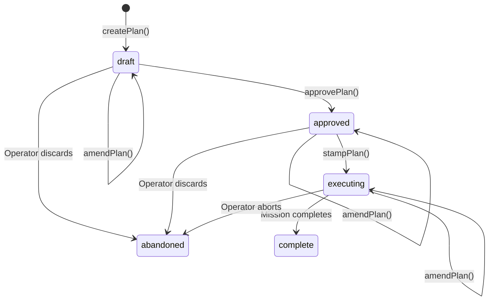

# Primitive: Plan

**Firestore path:** `plans/{planId}`

A Plan is an **unexecuted Mission blueprint**. It captures the full M→C→T layout — the Mission instruction, Checkpoint structure, and Task details — without creating any WorkEnvelopes. Plans go through an approval lifecycle before being "stamped" into live work.

---

## Fields

| Field | Type | Description |
|-------|------|-------------|
| `id` | `string` | Unique identifier (generated via `generateId('plan')`) |
| `project_id` | `string` | **Required.** Project this Plan belongs to |
| `work_id` | `string \| null` | Mission ID in the top-level `work/` collection (set when stamped) |
| `name` | `string` | Human-readable name (process name + instruction excerpt) |
| `process_id` | `string \| null` | Source process (if process-derived) |
| `process_version` | `number \| null` | Version of the source process |
| `parameters` | `Record<string, unknown>` | Parameters used to generate the layout |
| `layout` | `PlanLayout` | The M→C→T structure (see below) |
| `mission_id` | `string \| null` | Linked Mission ID (set when stamped) |
| `amendments` | `Amendment[]` | Change log (see below) |
| `status` | `'draft' \| 'approved' \| 'executing' \| 'complete' \| 'abandoned'` | Current state |
| `approved_by` | `string \| null` | Who approved (set on approval) |
| `approved_at` | `string \| null` | When approved |
| `created_at` | `string` | ISO 8601 timestamp |
| `updated_at` | `string` | Last update timestamp |

### PlanLayout

```typescript
{
  mission: {
    instruction: string;        // What the Mission should accomplish
    accept_criteria: string;    // Success criteria
    owner: string;              // Agent email or ID
  };
  checkpoints: {
    instruction: string;        // Checkpoint description
    accept_criteria: string;    // Checkpoint success criteria
    tasks: {
      instruction: string;      // Task instruction
      accept_criteria: string;  // Task success criteria
      agent: string;            // Target agent (e.g. "motor")
    }[];
  }[];
}
```

### Amendment

```typescript
{
  timestamp: string;     // When the amendment was made
  reason: string;        // Why the plan was changed
  changes: string;       // Description of changes (or JSON)
  amended_by: string;    // Who made the amendment
}
```

---

## Lifecycle



### State Descriptions

| State | Meaning | Can Amend? | Next States |
|-------|---------|:---:|-------------|
| `draft` | Layout created, awaiting review | ✓ | `approved`, `abandoned` |
| `approved` | Reviewed and approved, ready to stamp | ✓ | `executing`, `abandoned` |
| `executing` | WorkEnvelopes stamped, Mission is running | ✓ | `complete`, `abandoned` |
| `complete` | Linked Mission completed successfully | ✗ | — |
| `abandoned` | Discarded before or during execution | ✗ | — |

---

## Engine Functions

### `createPlan(processId, parameters, projectId, instruction)`

Creates a Plan in `draft` status:

1. Loads the process definition
2. Calls `processToCheckpointPlan()` to generate the checkpoint structure
3. Maps the result into `PlanLayout` format
4. Writes to Firestore at `plans/{planId}`
5. Returns the Plan document

### `approvePlan(planId, approvedBy)`

Transitions a `draft` Plan to `approved`:

1. Validates current status is `draft`
2. Sets `approved_by`, `approved_at`
3. Updates Firestore

### `stampPlan(planId, intake, memoryContext)`

Creates the live M→C→T hierarchy from an `approved` Plan:

1. Validates current status is `approved`
2. Creates a Mission envelope from `layout.mission`
3. For each checkpoint in `layout.checkpoints`:
   - Creates a Checkpoint envelope
   - For each task: creates a Task envelope
4. Links all envelopes via `parent_id` and `children`
5. Writes everything to Firestore
6. Sets `Plan.mission_id` to the new Mission ID
7. Transitions Plan to `executing`

### `amendPlan(planId, reason, changes, amendedBy)`

Records an amendment on a `draft`, `approved`, or `executing` Plan:

1. Validates Plan exists and is in an amendable state
2. Appends to the `amendments` array
3. Updates Firestore

---

## Auto-Approval

For routine work (simple processes, Responsibility firings), the engine may perform `createPlan` → `approvePlan` → `stampPlan` in a single call. This preserves current behavior while routing through the Plan layer for traceability.

---

## Plan ↔ Mission Linkage

When a Plan is stamped:
- `Plan.mission_id` → points to the created Mission
- `Mission.plan_id` → points back to the Plan
- All Checkpoints and Tasks also carry `plan_id` in their fields and `source_meta`

This bidirectional link enables the dashboard to show the Plan alongside its executing Mission.

---

## Example

### Draft Plan

```json
{
  "id": "plan-abc123",
  "project_id": "proj-auth-v2",
  "name": "Plan and Build: Add JWT authentication",
  "process_id": "p-plan",
  "process_version": 1,
  "parameters": {
    "goal": "Add JWT-based authentication to the API"
  },
  "layout": {
    "mission": {
      "instruction": "Execute process: Feature Implementation",
      "accept_criteria": "Process 'Plan and Build' completes all steps successfully.",
      "owner": "stan@company.com"
    },
    "checkpoints": [
      {
        "instruction": "Checkpoint 1: Validate implementation",
        "accept_criteria": "",
        "tasks": [
          {
            "instruction": "Set up workspace and branch...",
            "accept_criteria": "Feature branch created. Workspace clean.",
            "agent": "motor"
          },
          {
            "instruction": "Implement JWT authentication...",
            "accept_criteria": "All changes implemented. Conventions followed.",
            "agent": "motor"
          },
          {
            "instruction": "Run tests and validate...",
            "accept_criteria": "All tests pass. No regressions.",
            "agent": "motor"
          }
        ]
      },
      {
        "instruction": "Process Steps",
        "accept_criteria": "",
        "tasks": [
          {
            "instruction": "Commit and prepare for review...",
            "accept_criteria": "Changes committed. Branch pushed.",
            "agent": "motor"
          }
        ]
      }
    ]
  },
  "mission_id": null,
  "amendments": [],
  "status": "draft",
  "approved_by": null,
  "approved_at": null,
  "created_at": "2026-06-08T10:00:00Z",
  "updated_at": "2026-06-08T10:00:00Z"
}
```
