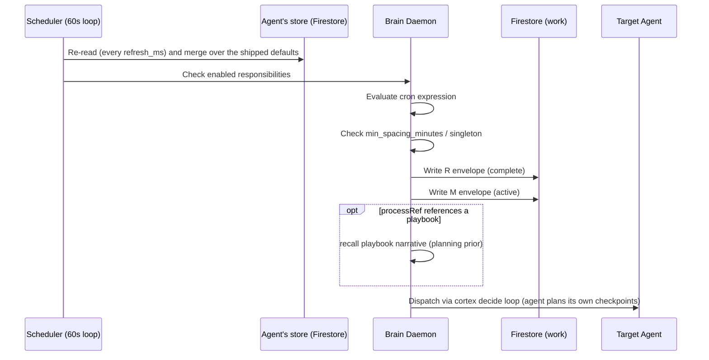
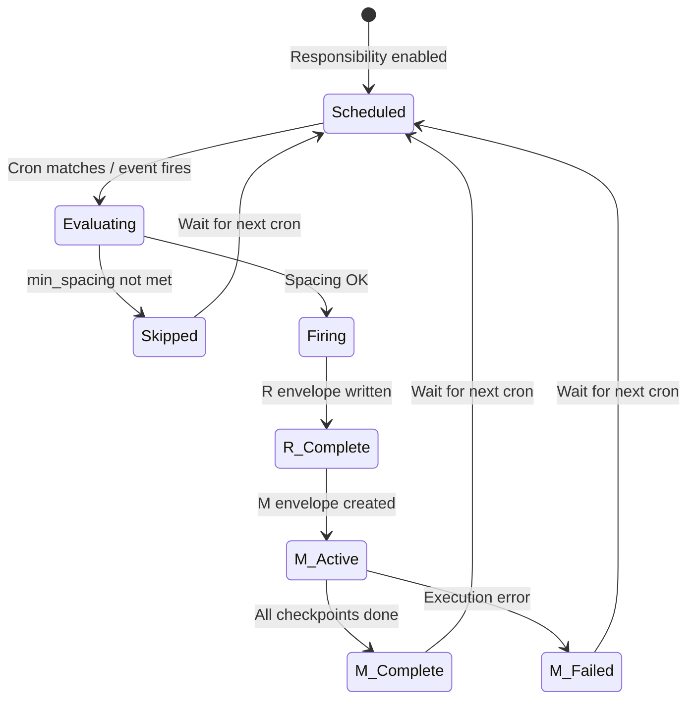

# Primitive: Responsibility

**WorkEnvelope type:** `R` (container only)
**Definition:** shipped defaults in `corekit/responsibilities*.json` + the agent's own store in Firestore at `primes/{primeId}/fleet/{agentId}/responsibilities/{id}` (a Prime's at `primes/{primeId}/responsibilities/{id}`)
**Envelope:** `work/{envelopeId}`

A Responsibility is **scheduled or event-triggered work** that automatically produces R→M envelope pairs. The brain daemon's scheduler runs the shipped defaults with the agent's own changes applied. A responsibility can reference a Process (playbook) whose narrative the fired Mission recalls.

---

## Where responsibilities live, and who changes them

A responsibility comes from one of three layers. Each layer has one kind of writer:

| Layer | Where | Who changes it, and how | Live after | Survives an upgrade |
|-------|-------|-------------------------|------------|:---:|
| **Platform** | `corekit/config/responsibilities.json` (+ `responsibilities-prime.json` on a Prime), marked `locked: true` | Only a platform release: repo commit + CoreKit upgrade (C-30). No agent, Prime or dashboard edit may override or disable it | the upgrade | n/a |
| **Role defaults** | `corekit/responsibilities-*.json` (e.g. `responsibilities-job.json`), shipped with the role or rendered from a Fleet release | **Prime**, for every agent of a role: `fleet-config change update responsibility` → validate → release → assign; `agent-content-sync` applies it (C-29, C-36) | the content-sync interval (5 min) | yes |
| **The agent's own** | Firestore store (above): overrides of role defaults and responsibilities the agent created | **The agent itself**, **Prime** improving that agent (`--agent <id>`), or the **dashboard** (introspect `set_responsibility_enabled`) — all through the same planner as `responsibility-manage` | one scheduler refresh (`responsibility_store.refresh_ms`, 60 s) | yes |

**Precedence.** The agent's own layer wins over role defaults. A platform responsibility is locked and ignores every store record.

**Overrides are field-level.** When an agent changes a default, the store keeps only the fields it changed, and `context` merges key by key. Later product fixes to the untouched fields still reach the agent. `adopt` takes a default over completely, and the agent then stops tracking it.

**Every change is checked.** A change must pass the responsibility schema (the same one the release path uses) and the cron forms the scheduler reads. The timezone must be a real IANA zone, and a schedule the author writes must stay above a frequency floor (`min_interval_minutes`, 15). A bad store record never takes a responsibility away: the scheduler logs it and keeps running the default.

**Every change is a revision.** Each write stores a new revision and a copy under `…/responsibilities/{id}/revisions/{n}`, so `history` shows who changed what and `revert` restores an earlier version. Writes are compare-and-swap, so a concurrent edit is refused rather than overwritten.

**Limits.** An agent may own at most `max_per_agent` (25) responsibilities outright; overrides of shipped defaults don't count toward that. Event responsibilities are spaced by at least the same floor and never chain (see *Event responsibilities*).

Nothing edits an installed responsibility file in place any more. Before the store existed, the agent's tool and the dashboard toggle both did, and the next upgrade silently reinstalled the file over their changes.

### responsibility-manage

```bash
responsibility-manage list                                  # what this agent runs, and where each comes from
responsibility-manage show r-weekly-report
responsibility-manage create --stdin < r-weekly-report.json # a new one of the agent's own
responsibility-manage update r-weekly-report '{"schedule":"20 10 * * 4","timezone":"America/Chicago"}'
responsibility-manage toggle r-weekly-report off
responsibility-manage reset r-weekly-report                 # drop your changes to a shipped default
responsibility-manage adopt r-weekly-report                 # take a shipped default over completely
responsibility-manage history r-weekly-report
responsibility-manage revert r-weekly-report --to 2
responsibility-manage --agent millie update r-weekly-report '{"enabled":false}'   # Prime only
```

`--note "<why>"` records the reason on the revision, and `--json` prints machine-readable output. A fleet agent can write only its own store. Prime can write its own store and the store of any agent under it. The procedure agents follow is in `skills/work-management/SKILL.md`.

---

## Definition Fields

The fields of a responsibility, whether it's shipped, released or in the agent's store. This is the flat v2 shape that `RESPONSIBILITY_SCHEMA` validates.

| Field | Type | Description |
|-------|------|-------------|
| `id` | `string` | Unique identifier, lowercase with dashes (e.g. `r-memory-consolidation`) |
| `name` | `string` | Human-readable name (≤ 80 chars) |
| `schedule` | `string \| null` | Five-field cron (`min hour dom month dow`), read in `timezone`. Exactly one of `schedule` or `event` |
| `event` | `string \| null` | An event name that fires this instead of a clock: `on_complete` or `on_failure` |
| `timezone` | `string` | IANA zone the schedule is written in (default `UTC`). DST moves the UTC instant, not the local time: `20 10 * * 4` + `America/Chicago` is 10:20 Central all year |
| `enabled` | `boolean` | Whether the scheduler fires it |
| `locked` | `boolean` | Platform upkeep: changes only through a platform release; no store record applies. Set only in the platform files |
| `singleton` | `boolean` | Refuse to fire while a previous firing is still in progress |
| `triggerable` | `boolean` | A user may ask the agent to run it out of turn |
| `effect_scope` | `'world' \| 'memory'` | Default `world`. `memory` means a firing writes ONLY the agent's memory layers (the nightly consolidation). The daemon plans it as ONE pass: a single temporal-memory task that carries the whole process, never a planner's split, because a split has no way to hand its triage forward. Delegations and approval gates are refused (`platform/work/memory-scope.mjs`) |
| `min_spacing_minutes` | `number \| null` | Minimum minutes between firings, independent of the cron |
| `instruction` | `string` | What the agent should do when it fires |
| `success_criteria` | `string` | How the agent knows a firing succeeded. It becomes the Mission's `accept_criteria`, and `context.success_criteria` is the legacy fallback |
| `context` | `ResponsibilityContext` | Rich context for the agent |
| `processRef` | `string \| null` | The playbook the fired Mission follows as its planning prior. The scheduler resolves it and carries its narrative into the mission's context (never as steps). A missing or retired playbook logs a WARN, and the mission fires on `context.process` alone |
| `processParameters` | `object \| null` | Optional parameters carried with the reference |
| `project_id` | `string \| null` | Project for generated Missions (falls back to the default project) |

### ResponsibilityContext

```typescript
{
  purpose: string;                  // Why this responsibility exists
  process: string[];                // Step-by-step instructions
  reference_files: string[];        // Files the agent should consult
  prior_learnings: string;          // Lessons from previous executions (hand-authored)
}
```

> **Machine-fed learnings (SESSION_CONTEXT_PLAN Phase 3):** the daemon also
> maintains a Firestore overlay at `primes/{id}/responsibility_state/{respId}`
> whose `prior_learnings` holds dated FIFO lines (`- [YYYY-MM-DD] lesson`,
> max `compaction.learnings_max_entries`) distilled from mission compaction
> digests. The scheduler merges config prose first, overlay lines after, into
> the firing's PRIOR LEARNINGS context. Neither the installed files nor the
> agent's store is the place for learnings.

---

## How Responsibilities Fire



### Scheduling Loop

1. Every 60 seconds, the daemon re-reads the agent's store if `refresh_ms` has passed. When the merged set changed, it re-arms **only** the responsibilities whose schedule, zone or enabled flag changed, so a slot that is already due is never dropped. An unreadable store keeps the last good set.
2. It iterates all enabled responsibilities. For each, it checks whether the next fire time has arrived: the next cron match in its `timezone`, looked up to 8 days ahead. A slot further out, such as a monthly schedule, has no next fire yet. The loop re-checks hourly and arms it as it comes into range, so a long cadence is never dropped.
3. It checks `min_spacing_minutes`. If the responsibility fired too recently, it skips and advances to the next fire time.
4. It fires the responsibility:
   - Create an **R envelope** (type `R`, immediately `complete`).
   - Create an **M envelope** (type `M`, `active`, child of R). Its `source_meta` records `responsibility_origin` (`shipped`, `override` or `agent`) and `responsibility_revision`, so the work pins the exact definition that produced it (C-32).
   - Dispatch the Mission into the cortex decide loop, where the agent plans its own checkpoints (C-15). If `processRef` references a playbook, the scheduler has already carried its narrative into the mission's context as a planning prior. Deployment-specific inputs (folder ids, a brand doc) are resource references of the mission's **project** (`project_id`), never memory.

Installed files still hot-reload: the brain watches `corekit/responsibilities*.json`, which the upgrade and content-sync write.

### The R→M Envelope Pair

```
R (Responsibility envelope)
└── M (Mission envelope)
    ├── C₁ (Checkpoint)
    │   ├── T₁ (Task)
    │   └── T₂ (Task)
    └── C₂ (Checkpoint)
        └── T₃ (Task)
```

The R envelope is a thin wrapper that completes immediately. Its purpose is to track the *trigger*: which responsibility, what schedule, when it fired. The M envelope contains the actual work.

### min_spacing_minutes

Prevents a responsibility from firing too frequently. If a responsibility fires at 2:00 AM with `min_spacing_minutes: 720` (12 hours), the next firing won't happen until at least 2:00 PM, even if the cron expression would match sooner.

---

## Event responsibilities

A responsibility with `event` instead of `schedule` fires when that event happens:

| `event` | Fires when |
|---------|-----------|
| `on_complete` | A Mission completes |
| `on_failure` | A Mission ends blocked |

Event firing runs over the same effective set as the clock (shipped defaults + the agent's store). Two guards keep an agent-written event responsibility from turning into a loop:

- **No chains.** A Mission that an event responsibility produced never fires another event responsibility, and no responsibility fires from its own Mission.
- **Spacing.** An event responsibility waits at least `max(min_spacing_minutes, responsibility_store.min_interval_minutes)` between firings.

---

## project_id Resolution

When a responsibility fires and creates an M envelope:

1. Use `resp.project_id` if set
2. Fall back to `DEFAULT_PROJECT_ID` (`general`)

---

## Lifecycle of a Fired Responsibility



---

## Example Responsibility Definitions

### Cron-Scheduled with processRef

```json
{
  "id": "r-nightly-audit",
  "name": "Nightly Security Audit",
  "schedule": "0 3 * * *",
  "timezone": "America/New_York",
  "enabled": true,
  "singleton": true,
  "min_spacing_minutes": 1440,
  "instruction": "Run security audit on the core API module",
  "success_criteria": "Audit report produced. Critical findings flagged.",
  "processRef": "p-audit",
  "project_id": "proj-security",
  "context": {
    "purpose": "Automated nightly security scan",
    "process": ["Scan the auth middleware and input validation", "Write the report"],
    "prior_learnings": "Focus on auth middleware and input validation."
  }
}
```

### Event-Triggered

```json
{
  "id": "r-failure-review",
  "name": "Post-Failure Review",
  "event": "on_failure",
  "enabled": true,
  "min_spacing_minutes": 60,
  "instruction": "Review the blocked mission and record what stopped it",
  "success_criteria": "A short review names the blocking cause and the next step.",
  "context": {
    "purpose": "Learn from blocked work while it is fresh",
    "process": ["Read the blocked mission's record", "Write the review"]
  }
}
```

An event responsibility has no `schedule`. The old trick of a cron that never matches (`0 0 31 2 *`) is refused: a responsibility takes a schedule or an event, never both.

See [Authoring Responsibilities](../guides/AUTHORING_RESPONSIBILITIES.md) for the full writing guide.
