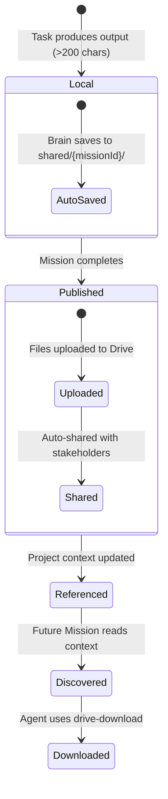
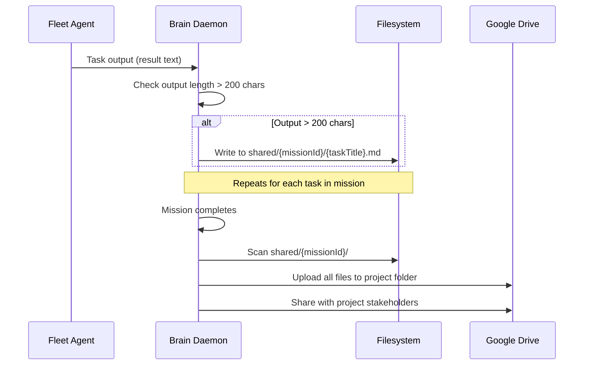
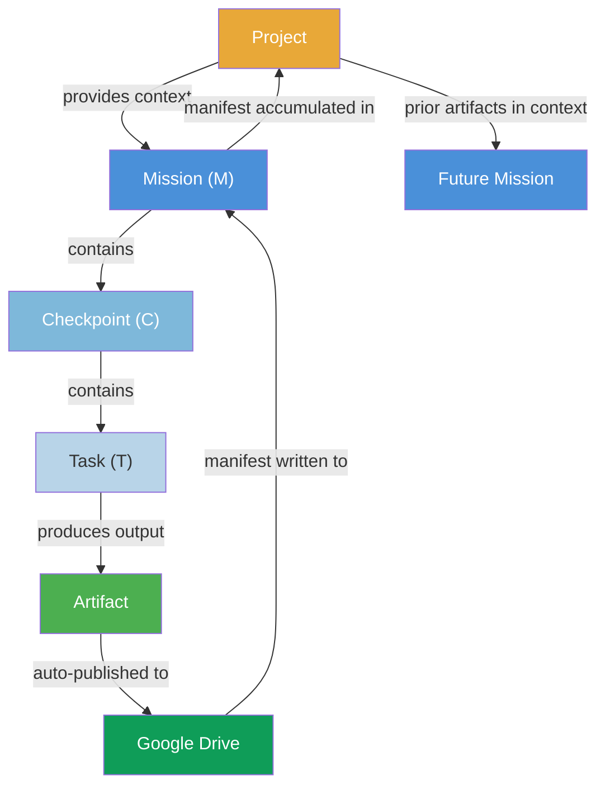
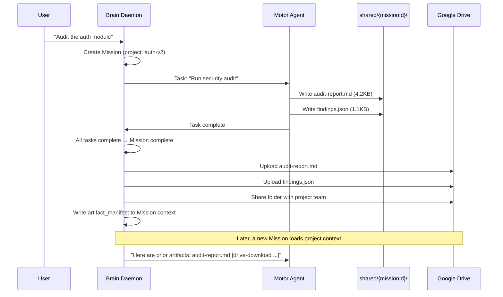

# Primitive: Artifact

**Storage:** Git repos (GCS bundles + Firestore refs, primary) / Google Drive (published, stakeholder-facing) / `shared/{missionId}/` (local during execution)
**Not a WorkEnvelope** — artifacts are files in the git artifact ether and optionally published to Google Drive, referenced via project context.

An Artifact is a **file produced during a Mission with lasting value** — plans, reports, configurations, code bundles, analysis outputs, or any other deliverable. Unlike ephemeral task outputs that live only in WorkEnvelope fields, artifacts persist in the git artifact substrate (C-24) and are discoverable across future Missions via project context and branch history.

---

## What Qualifies as an Artifact

| Category | Examples |
|----------|---------|
| **Plans & Reports** | Architecture proposals, audit reports, investigation findings |
| **Code & Config** | Generated scripts, config files, migration playbooks |
| **Analysis** | Performance benchmarks, dependency graphs, security scan results |
| **Documentation** | READMEs, API specs, runbooks |
| **Data** | CSV exports, JSON snapshots, test result summaries |

**Not artifacts:** Intermediate scratch work, debug logs, single-line status updates. The auto-persistence threshold (>200 chars) naturally filters these out.

---

## Lifecycle



### Phase 1: Local (During Execution)

- Task outputs exceeding **200 characters** are auto-saved by the Brain daemon to `shared/{missionId}/`
- The shared directory is backed by a git working tree: `mission/{missionId}` branch cloned from the project repo (C-24)
- Files are written locally — no network overhead during execution
- Agents can also write files directly to `shared/{missionId}/` via their tools

### Phase 2: Committed (Checkpoint Completion)

- After each checkpoint completes, the Brain commits all changes and pushes to the ether
- Commit messages follow canonical format (C-23): `v{YYYY}.{MM}.{DD}.{cpNum}.0: {checkpoint title}`
- Changes are synced to the git ether (GCS bundles + Firestore refs) after each checkpoint
- This provides incremental durability — work is never lost even if the mission fails later

### Phase 3: Published (Mission Completion)

- When a Mission completes, two publish steps run in parallel:
  - **Git substrate:** Final commit + merge mission branch → main + build manifest
  - **Drive substrate:** All files uploaded to the project's Google Drive folder
- An `artifact_manifest` and `git_artifacts` manifest are written to the Mission envelope context
- Files are auto-shared with the project owner and stakeholders (Drive only)

### Phase 4: Discoverable (Future Missions)

- The artifact manifests (both git and Drive) are included in project context
- When future Missions load project context, prior artifacts are listed
- Agents can clone the repo to access full file history, or use `drive-download` for specific files

---

## Drive Folder Structure

Artifacts are organized in Google Drive under a configured root folder:

```
{root}/
├── {project-name}/
│   ├── {prime-name}/
│   │   ├── {agent-name}/
│   │   │   ├── mission-abc123/
│   │   │   │   ├── architecture-proposal.md
│   │   │   │   ├── dependency-analysis.json
│   │   │   │   └── test-results.csv
│   │   │   └── mission-def456/
│   │   │       └── audit-report.md
│   │   └── {another-agent}/
│   │       └── ...
│   └── {another-prime}/
│       └── ...
└── {another-project}/
    └── ...
```

### Path Formula

```
{drive_root}/{project-name}/{prime-name}/{agent-name}/
```

| Segment | Source | Example |
|---------|--------|---------|
| `{drive_root}` | Configured root Drive folder | `Architect Prime Artifacts` |
| `{project-name}` | `project.name` from Firestore | `Authentication V2` |
| `{prime-name}` | Prime identifier | `prime-alpha` |
| `{agent-name}` | Agent identifier | `motor-01` |

### Default Project Exception

Each agent's **default project** (`{agentId}/general`) does not use the shared root folder. Instead, artifacts for the general project are stored in the agent's **My Drive root**. This keeps general-purpose work in the agent's own space without cluttering the shared project hierarchy.

---

## Auto-Persistence

The Brain daemon automatically saves significant task outputs to the local artifact directory:



**Rules:**
- Only outputs exceeding **200 characters** are auto-persisted
- File names are derived from the task title (sanitized for filesystem safety)
- Agents can also write arbitrary files to `shared/{missionId}/` directly
- The `shared/` directory is cleaned up after successful publish

---

## Auto-Publish on Mission Completion

When a Mission transitions to `complete`:

#### Git Substrate (Primary)
1. **Commit** any remaining changes on the mission branch
2. **Push** the mission branch to the ether (GCS bundles + Firestore refs)
3. **Merge** the mission branch into `main` (auto policy by default)
4. **Build manifest** — tree listing of all files on main with commit info
5. **Write** a `git_artifacts` manifest to the Mission envelope context

#### Drive Substrate (Stakeholder-Facing)
1. **Scan** `shared/{missionId}/` for all files
2. **Create** the project folder path in Drive if it doesn't exist
3. **Upload** each file to the Drive folder
4. **Share** the folder with the project owner and stakeholders
5. **Write** an `artifact_manifest` to the Mission envelope context
6. **Clean up** the local `shared/{missionId}/` directory

### Auto-Sharing (Drive Only)

Published artifacts are automatically shared with:
- The **project owner** (`project.owner`) — Editor access
- All **team members** in `project.context.team` — Viewer access
- The **requesting user** (if the Mission was user-initiated) — Viewer access

---

## Cross-Mission Access

Prior artifacts are discoverable through project context. When a Mission loads its project context, the accumulated artifact manifests from prior Missions are included, giving agents a clear picture of what has already been produced.

### How Agents Access Prior Artifacts

1. **Project context** includes artifact manifests from completed Missions
2. Each manifest entry includes a `drive-download` command
3. Agents use the `drive-download` tool with the file's `driveId` to fetch the file locally
4. Downloaded files are available for reading, analysis, or building upon

### Access Requests

If an agent lacks access to a project's Drive folder (e.g., a new agent joining an existing project), it should **request access** for its workspace email. The Brain daemon handles permission grants through the Drive API.

---

## Artifact Manifest Schema

When artifacts are published, an `artifact_manifest` context entry is written to the Mission envelope:

```json
{
  "kind": "artifact_manifest",
  "summary": "Architecture proposal and dependency analysis for JWT migration",
  "drive_folder": "1AbC2dEf3GhI4jKlMnOpQrStUvWxYz",
  "drive_url": "https://drive.google.com/drive/folders/1AbC2dEf3GhI4jKlMnOpQrStUvWxYz",
  "files": [
    {
      "name": "architecture-proposal.md",
      "driveId": "1XyZ9wVu8TsRqPoNmLkJiHgFeDcBa",
      "url": "https://drive.google.com/file/d/1XyZ9wVu8TsRqPoNmLkJiHgFeDcBa/view",
      "size": 14720
    },
    {
      "name": "dependency-analysis.json",
      "driveId": "1AaBbCcDdEeFfGgHhIiJjKkLlMmNn",
      "url": "https://drive.google.com/file/d/1AaBbCcDdEeFfGgHhIiJjKkLlMmNn/view",
      "size": 4096
    },
    {
      "name": "test-results.csv",
      "driveId": "1OoPpQqRrSsTtUuVvWwXxYyZz0011",
      "url": "https://drive.google.com/file/d/1OoPpQqRrSsTtUuVvWwXxYyZz0011/view",
      "size": 2048
    }
  ]
}
```

### Manifest Fields

| Field | Type | Description |
|-------|------|-------------|
| `kind` | `'artifact_manifest'` | Identifies this context entry as an artifact manifest |
| `summary` | `string` | Human-readable summary of the artifacts produced |
| `drive_folder` | `string` | Google Drive folder ID containing the artifacts |
| `drive_url` | `string` | Direct URL to the Drive folder |
| `files` | `ArtifactFile[]` | Array of published files |

### ArtifactFile Fields

| Field | Type | Description |
|-------|------|-------------|
| `name` | `string` | Filename as published |
| `driveId` | `string` | Google Drive file ID |
| `url` | `string` | Direct URL to the file in Drive |
| `size` | `number` | File size in bytes |

### Git Artifact Manifest (`git_artifacts`)

When the git substrate publishes, a `git_artifacts` context entry is also written:

```json
{
  "repoId": "my-project",
  "branch": "main",
  "sha": "abc123def456...",
  "files": ["architecture-proposal.md", "dependency-analysis.json"],
  "commitCount": 5,
  "generatedAt": "2026-07-03T22:00:00Z"
}
```

| Field | Type | Description |
|-------|------|-------------|
| `repoId` | `string` | Project ID (= git repo ID) |
| `branch` | `string` | Branch the manifest was built from (always `main` after merge) |
| `sha` | `string` | Git SHA of the branch tip |
| `files` | `string[]` | List of file paths in the repo tree |
| `commitCount` | `number` | Total commits on the branch |
| `generatedAt` | `string` | ISO timestamp of manifest generation |

---

## Agent Behavior Rules

### MUST Include Drive Links

When an agent produces artifacts during a Mission, it **MUST** include Google Drive links in its response to the user. This ensures stakeholders can immediately access the deliverables without searching Drive.

**Good response:**
```
✅ Architecture proposal complete.

📎 Published artifacts:
- [architecture-proposal.md](https://drive.google.com/file/d/1XyZ.../view)
- [dependency-analysis.json](https://drive.google.com/file/d/1AaB.../view)

Drive folder: https://drive.google.com/drive/folders/1AbC...
```

**Bad response:**
```
❌ Architecture proposal complete. The files have been saved.
```

### Writing Artifacts During Execution

Agents write to the local `shared/{missionId}/` directory during task execution. This is fast (local filesystem) and requires no network access. The publish step happens automatically on Mission completion.

```
# During task execution
write_file("shared/{missionId}/proposal.md", content)
```

---

## Relationship to Other Primitives



- **Task** → produces the raw output that becomes an artifact
- **Checkpoint** → triggers a git commit+sync of accumulated work
- **Mission** → owns the artifact manifests (git + Drive); publish triggered on Mission completion
- **Project** → accumulates manifests in context for cross-mission discovery; one git repo per project
- **Process** → can define steps that explicitly produce artifacts (e.g., "generate report" steps)

---

## Example: End-to-End Flow


