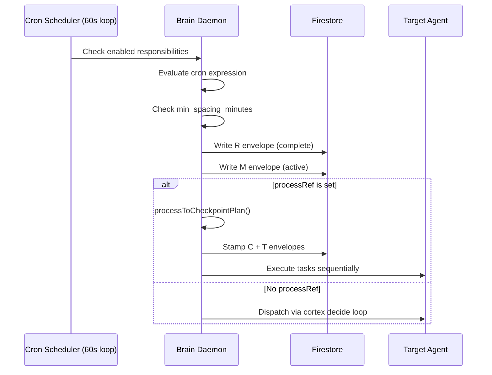
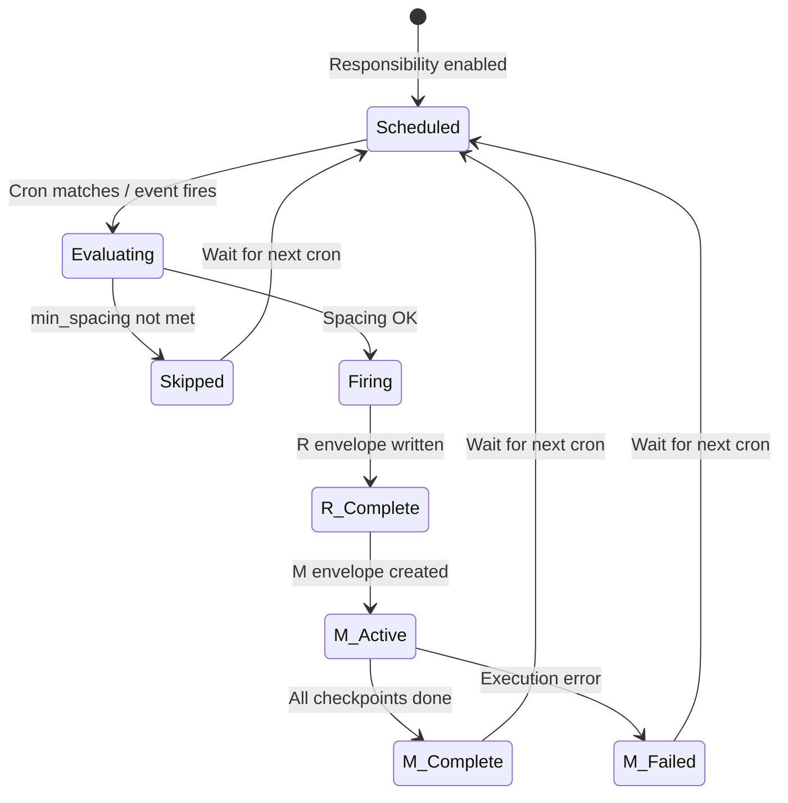

# Primitive: Responsibility

**WorkEnvelope type:** `R` (container only)
**Firestore path (definition):** `corekit/config/responsibilities.json`
**Firestore path (envelope):** `primes/{primeId}/work/{envelopeId}`

A Responsibility is **scheduled or event-triggered work** that automatically produces R→M envelope pairs. Responsibilities are defined in JSON configuration, managed by the brain daemon's cron scheduler, and can optionally link to a Process for deterministic execution.

---

## Definition Fields

These fields are in the responsibility JSON definition (not the WorkEnvelope):

| Field | Type | Description |
|-------|------|-------------|
| `id` | `string` | Unique identifier (e.g. `r-memory-consolidation`) |
| `name` | `string` | Human-readable name |
| `schedule` | `string` | Cron expression (5-field: `min hour dom month dow`) |
| `enabled` | `boolean` | Whether the scheduler fires this responsibility |
| `min_spacing_minutes` | `number` | Minimum minutes between firings |
| `instruction` | `string` | What the agent should do when this fires |
| `context` | `ResponsibilityContext` | Rich context for the agent |
| `processRef` | `string \| null` | Process ID to execute (if process-linked) |
| `processParameters` | `Record<string, unknown> \| null` | Parameter overrides for the linked process |
| `project_id` | `string \| null` | Project for generated Missions (falls back to default) |
| `trigger` | `string \| null` | Event trigger: `'on_complete'`, `'on_failure'`, `'on_merge'` **(not yet implemented)**, `'on_deploy'` **(not yet implemented)**, or `null` |

### ResponsibilityContext

```typescript
{
  purpose: string;                  // Why this responsibility exists
  process: string[];                // Step-by-step instructions
  reference_files: string[];        // Files the agent should consult
  success_criteria: string;         // What constitutes a successful execution
  prior_learnings: string;          // Lessons from previous executions
}
```

---

## Responsibility Config File

Responsibilities are defined in `corekit/config/responsibilities.json`:

```json
{
  "version": 1,
  "responsibilities": [
    {
      "id": "r-memory-consolidation",
      "name": "Nightly Memory Consolidation",
      "schedule": "0 8 * * *",
      "enabled": true,
      "min_spacing_minutes": 720,
      "instruction": "Execute the nightly memory consolidation cycle...",
      "context": {
        "purpose": "MEMORY.md is the agent's working scratchpad...",
        "process": [
          "STEP 1 — GATHER WORKING MEMORY: ...",
          "STEP 2 — GATHER SESSIONS: ..."
        ],
        "reference_files": ["workspace/MEMORY.md", "workspace/SOUL.md"],
        "success_criteria": "MEMORY.md is rewritten...",
        "prior_learnings": "Be conservative with promotions..."
      }
    }
  ]
}
```

Prime-specific responsibilities go in `responsibilities-prime.json`.

---

## How Responsibilities Fire



### Scheduling Loop

1. Every 60 seconds, the daemon iterates all enabled responsibilities
2. For each: check if the cron expression matches the current time
3. Check `min_spacing_minutes` — if fired too recently, skip and advance to next fire time
4. Fire the responsibility:
   - Create **R envelope** (type `R`, immediately `complete`)
   - Create **M envelope** (type `M`, `active`, child of R)
   - If `processRef` → load process, stamp C+T hierarchy, execute deterministically
   - If no `processRef` → inject into cortex decide loop

### The R→M Envelope Pair

```
R (Responsibility envelope)
└── M (Mission envelope)
    ├── C₁ (Checkpoint)
    │   ├── T₁ (Task)
    │   └── T₂ (Task)
    └── C₂ (Checkpoint)
        └── T₃ (Task)
```

The R envelope is a thin wrapper — it completes immediately. Its purpose is to track the *trigger* (which responsibility, what schedule, when fired). The M envelope contains the actual work.

### min_spacing_minutes

Prevents a responsibility from firing too frequently. If a responsibility fires at 2:00 AM with `min_spacing_minutes: 720` (12 hours), the next firing won't happen until at least 2:00 PM, even if the cron expression would match sooner.

---

## Event Triggers

The `trigger` field enables event-driven responsibilities (in addition to cron-scheduled):

| Trigger | Fires When |
|---------|-----------|
| `on_complete` | A Mission completes successfully |
| `on_failure` | A Mission fails |
| `on_merge` | A code merge/PR completes **(not yet implemented)** |
| `on_deploy` | A deployment finishes **(not yet implemented)** |
| `null` | Cron-only (no event trigger) |

Event-driven firing uses `fireEventResponsibilities(eventType)`, which scans all responsibilities with matching `trigger` and fires them (subject to `min_spacing_minutes`).

---

## project_id Resolution

When a responsibility fires and creates an M envelope:

1. Use `resp.project_id` if set
2. Fall back to `DEFAULT_PROJECT_ID` (`{agent-id}/general`)

---

## Lifecycle of a Fired Responsibility



---

## Example Responsibility Definition

### Cron-Scheduled with processRef

```json
{
  "id": "r-nightly-audit",
  "name": "Nightly Security Audit",
  "schedule": "0 3 * * *",
  "enabled": true,
  "min_spacing_minutes": 1440,
  "instruction": "Run security audit on the core API module",
  "processRef": "p-audit",
  "processParameters": {
    "scope": "app/src/api/",
    "criteria": "security"
  },
  "project_id": "proj-security",
  "context": {
    "purpose": "Automated nightly security scan",
    "success_criteria": "Audit report produced. Critical findings flagged.",
    "prior_learnings": "Focus on auth middleware and input validation."
  }
}
```

### Event-Triggered (Planned)

```json
{
  "id": "r-post-deploy-verify",
  "name": "Post-Deployment Verification",
  "schedule": "0 0 31 2 *",
  "enabled": true,
  "min_spacing_minutes": 30,
  "instruction": "Verify the deployment is healthy",
  "trigger": "on_deploy",
  "processRef": "p-deploy-verify",
  "project_id": null
}
```

> **Note:** For event-triggered responsibilities, the `schedule` cron expression can be set to a value that never fires (like `0 0 31 2 *` — Feb 31st) so it only fires on events.

See [Authoring Responsibilities](../guides/AUTHORING_RESPONSIBILITIES.md) for the full writing guide.
